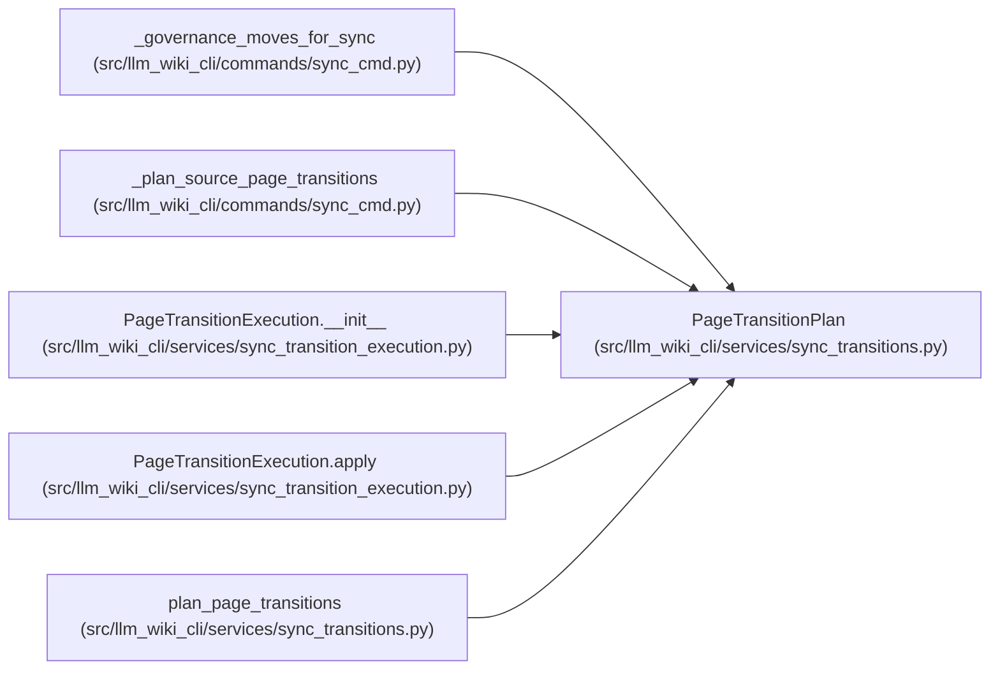

# PageTransitionPlan

**Location:** `src/llm_wiki_cli/services/sync_transitions.py:66`
**Kind:** Class
**Bases:** —
**Module:** [sync_transitions](../modules/sync_transitions.md)

**Decorators:** `@dataclass(frozen=True)`

## Description

_Auto-generated from `PageTransitionPlan` in `src/llm_wiki_cli/services/sync_transitions.py`._

## Attributes

| Name | Type | Default | Description |
|------|------|---------|-------------|
| `transitions` | `tuple[PageTransition, ...]` | *required* | — |
| `staged_moves` | `tuple[StagedPageMove, ...]` | *required* | — |
| `reserved_path_keys` | `tuple[str, ...]` | *required* | — |
| `retained_page_repairs` | `tuple[RetainedPageRepair, ...]` | `()` | — |

## Methods

*No public methods. Inherits from base classes.*

## Relationships

<!-- Auto-generated relationship summary. Do not edit by hand. -->

### Summary

| Module | Methods | Attributes |
|---|---:|---|
| [sync_transitions](../modules/sync_transitions.md) | 0 | `reserved_path_keys`, `retained_page_repairs`, `staged_moves`, `transitions` |

### References

| Reference | Kind | Source | Call sites |
|---|---|---|---:|
| `_governance_moves_for_sync` | type_reference | [sync_cmd](../modules/sync_cmd.md) | — |
| `_plan_source_page_transitions` | type_reference | [sync_cmd](../modules/sync_cmd.md) | — |
| `PageTransitionExecution.__init__` | type_reference | [sync_transition_execution](../modules/sync_transition_execution.md) | — |
| `PageTransitionExecution.apply` | type_reference | [sync_transition_execution](../modules/sync_transition_execution.md) | — |
| `plan_page_transitions` | call | [sync_transitions](../modules/sync_transitions.md) | 1 |
| `plan_page_transitions` | type_reference | [sync_transitions](../modules/sync_transitions.md) | — |
