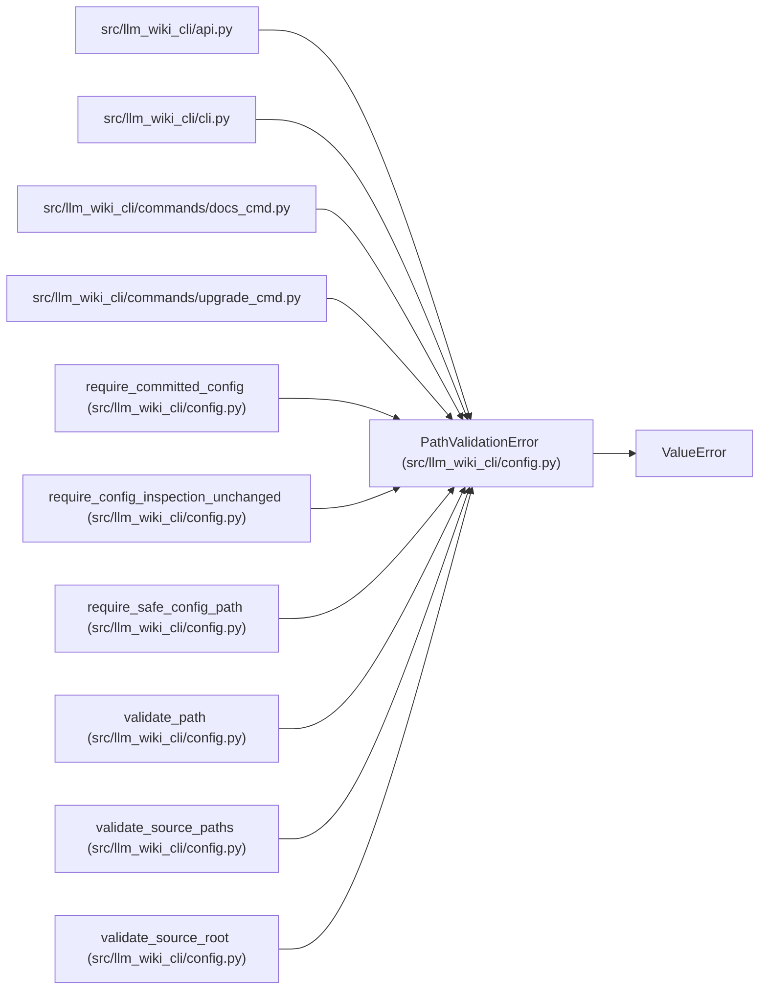

# PathValidationError

**Location:** `src/llm_wiki_cli/config.py:121`
**Kind:** Class
**Bases:** `ValueError`
**Module:** [config](../modules/config.md)

## Description

Raised when a user-provided path escapes the project root.

## Attributes

*No annotated attributes found.*

## Methods

*No public methods. Inherits from base classes.*

## Relationships

<!-- Auto-generated relationship summary. Do not edit by hand. -->

### Summary

| Module | Methods | Attributes |
|---|---:|---|
| [config](../modules/config.md) | 0 | — |

### Structure

| Kind | Entity | Module |
|---|---|---|
| Base | `ValueError` | — |

### References

| Reference | Kind | Source |
|---|---|---|
| `api` | import | [api](../modules/api.md) |
| `cli` | import | [cli](../modules/cli.md) |
| `docs_cmd` | import | [docs_cmd](../modules/docs_cmd.md) |
| `upgrade_cmd` | import | [upgrade_cmd](../modules/upgrade_cmd.md) |
| `require_committed_config` | call | [config](../modules/config.md) |
| `require_config_inspection_unchanged` | call | [config](../modules/config.md) |
| `require_safe_config_path` | call | [config](../modules/config.md) |
| `require_safe_config_path` | call | [config](../modules/config.md) |
| `validate_path` | call | [config](../modules/config.md) |
| `validate_path` | call | [config](../modules/config.md) |
| `validate_source_paths` | call | [config](../modules/config.md) |
| `validate_source_root` | call | [config](../modules/config.md) |
