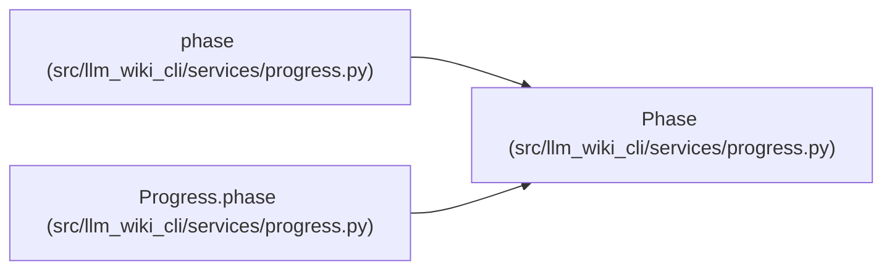

# Phase

**Location:** `src/llm_wiki_cli/services/progress.py:40`
**Kind:** Class
**Bases:** —
**Module:** [progress](../modules/progress.md)

**Decorators:** `@dataclass(eq=False)`

## Description

_Auto-generated from `Phase` in `src/llm_wiki_cli/services/progress.py`._

## Attributes

| Name | Type | Default | Description |
|------|------|---------|-------------|
| `name` | `str` | *required* | — |
| `started` | `float` | *required* | — |
| `elapsed_seconds` | `float` | `0.0` | — |
| `announced` | `bool` | `False` | — |
| `owner` | `int` | `field(default_factory=threading.get_ident)` | — |

## Methods

*No public methods. Inherits from base classes.*

## Relationships

<!-- Auto-generated relationship summary. Do not edit by hand. -->

### Summary

| Module | Methods | Attributes |
|---|---:|---|
| [progress](../modules/progress.md) | 0 | `announced`, `elapsed_seconds`, `name`, `owner`, `started` |

### References

| Reference | Kind | Source | Call sites |
|---|---|---|---:|
| `phase` | call | [progress](../modules/progress.md) | 1 |
| `phase` | type_reference | [progress](../modules/progress.md) | — |
| `Progress.phase` | call | [progress](../modules/progress.md) | 1 |
| `Progress.phase` | type_reference | [progress](../modules/progress.md) | — |
