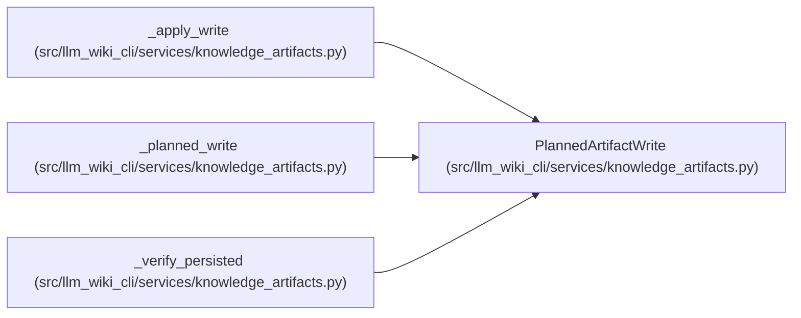

# PlannedArtifactWrite

**Location:** `src/llm_wiki_cli/services/knowledge_artifacts.py:98`
**Kind:** Class
**Bases:** —
**Module:** [knowledge_artifacts](../modules/knowledge_artifacts.md)

**Decorators:** `@dataclass(frozen=True)`

## Description

One exact-byte action in a knowledge artifact commit.

## Attributes

| Name | Type | Default | Description |
|------|------|---------|-------------|
| `path` | `Path` | *required* | — |
| `relative_path` | `str` | *required* | — |
| `state` | `ArtifactWriteState` | *required* | — |
| `content_hash` | `str` | *required* | — |
| `content` | `bytes` | *required* | — |
| `needs_write` | `bool` | *required* | — |

## Methods

*No public methods. Inherits from base classes.*

## Relationships

<!-- Auto-generated relationship summary. Do not edit by hand. -->

### Summary

| Module | Methods | Attributes |
|---|---:|---|
| [knowledge_artifacts](../modules/knowledge_artifacts.md) | 0 | `content`, `content_hash`, `needs_write`, `path`, `relative_path`, `state` |

### References

| Reference | Kind | Source |
|---|---|---|
| `_apply_write` | type_reference | [knowledge_artifacts](../modules/knowledge_artifacts.md) |
| `_planned_write` | call | [knowledge_artifacts](../modules/knowledge_artifacts.md) |
| `_planned_write` | type_reference | [knowledge_artifacts](../modules/knowledge_artifacts.md) |
| `_verify_persisted` | type_reference | [knowledge_artifacts](../modules/knowledge_artifacts.md) |
