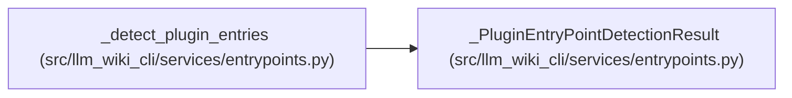

# _PluginEntryPointDetectionResult

**Location:** `src/llm_wiki_cli/services/entrypoints.py:63`
**Kind:** Class
**Bases:** —
**Module:** [entrypoints](../modules/entrypoints.md)

**Decorators:** `@dataclass(frozen=True)`

## Description

_Auto-generated from `_PluginEntryPointDetectionResult` in `src/llm_wiki_cli/services/entrypoints.py`._

## Attributes

| Name | Type | Default | Description |
|------|------|---------|-------------|
| `entries` | `list[dict]` | *required* | — |
| `warnings` | `list[str]` | *required* | — |
| `omitted` | `int` | *required* | — |
| `detector_failures` | `int` | *required* | — |

## Methods

*No public methods. Inherits from base classes.*

## Relationships

<!-- Auto-generated relationship summary. Do not edit by hand. -->

### Summary

| Module | Methods | Attributes |
|---|---:|---|
| [entrypoints](../modules/entrypoints.md) | 0 | `detector_failures`, `entries`, `omitted`, `warnings` |

### References

| Reference | Kind | Source | Call sites |
|---|---|---|---:|
| `_detect_plugin_entries` | call | [entrypoints](../modules/entrypoints.md) | 1 |
| `_detect_plugin_entries` | type_reference | [entrypoints](../modules/entrypoints.md) | — |
