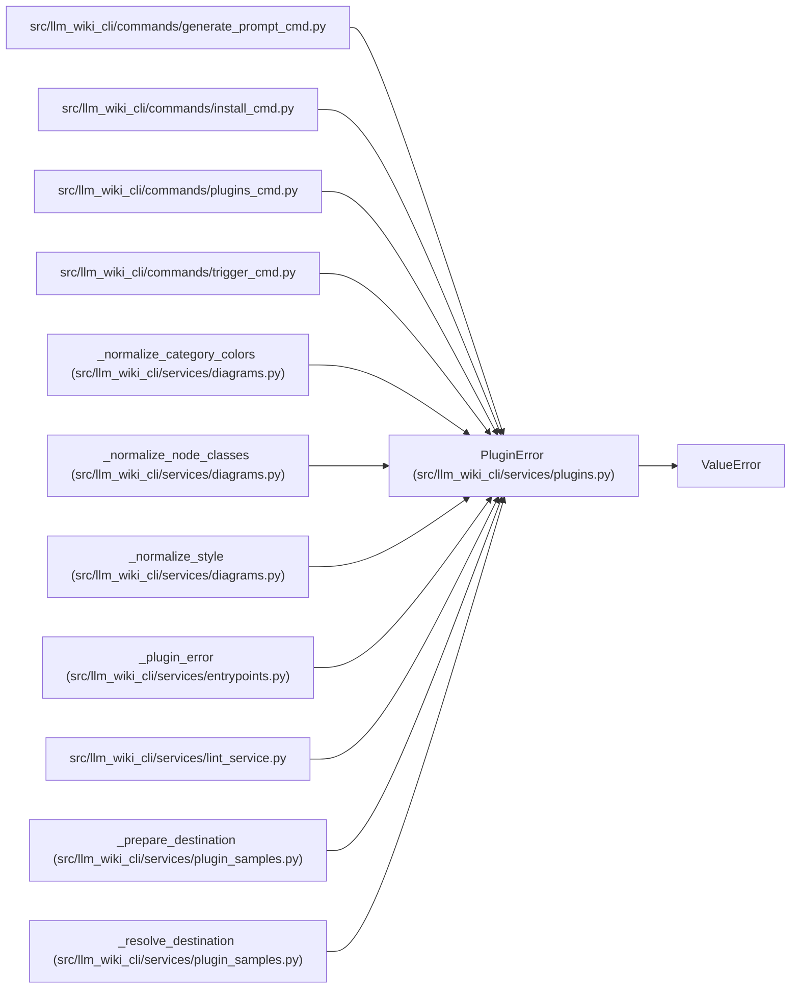

# PluginError

**Location:** `src/llm_wiki_cli/services/plugins.py:56`
**Kind:** Class
**Bases:** `ValueError`
**Module:** [plugins](../modules/plugins.md)

## Description

Raised when a plugin manifest, install, or lookup is invalid.

## Attributes

*No annotated attributes found.*

## Methods

*No public methods. Inherits from base classes.*

## Relationships

<!-- Auto-generated relationship summary. Do not edit by hand. -->

### Summary

| Module | Methods | Attributes |
|---|---:|---|
| [plugins](../modules/plugins.md) | 0 | — |

### Structure

| Kind | Entity | Module |
|---|---|---|
| Base | `ValueError` | — |

### References

| Reference | Kind | Source | Call sites |
|---|---|---|---:|
| `generate_prompt_cmd` | import | [generate_prompt_cmd](../modules/generate_prompt_cmd.md) | — |
| `install_cmd` | import | [install_cmd](../modules/install_cmd.md) | — |
| `plugins_cmd` | import | [plugins_cmd](../modules/plugins_cmd.md) | — |
| `trigger_cmd` | import | [trigger_cmd](../modules/trigger_cmd.md) | — |
| `_normalize_category_colors` | call | [diagrams](../modules/diagrams.md) | 2 |
| `_normalize_node_classes` | call | [diagrams](../modules/diagrams.md) | 2 |
| `_normalize_style` | call | [diagrams](../modules/diagrams.md) | 2 |
| `_plugin_error` | call | [entrypoints](../modules/entrypoints.md) | 1 |
| `_plugin_error` | type_reference | [entrypoints](../modules/entrypoints.md) | — |
| `lint_service` | import | [lint_service](../modules/lint_service.md) | — |
| `_prepare_destination` | call | [plugin_samples](../modules/plugin_samples.md) | 2 |
| `_resolve_destination` | call | [plugin_samples](../modules/plugin_samples.md) | 2 |

> References: showing 12 of 35 logical references; 23 omitted by the 12-row generated summary limit.
