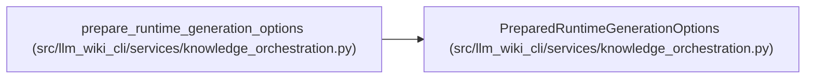

# PreparedRuntimeGenerationOptions

**Location:** `src/llm_wiki_cli/services/knowledge_orchestration.py:202`
**Kind:** Class
**Bases:** —
**Module:** [knowledge_orchestration](../modules/knowledge_orchestration.md)

**Decorators:** `@dataclass(frozen=True)`

## Description

Canonical writer/reader inputs for the generation-options commitment.

## Attributes

| Name | Type | Default | Description |
|------|------|---------|-------------|
| `values` | `Mapping[str, Any]` | *required* | — |
| `defaults` | `Mapping[str, Any]` | *required* | — |
| `allowlist` | `tuple[str, ...]` | *required* | — |

## Methods

*No public methods. Inherits from base classes.*

## Relationships

<!-- Auto-generated relationship summary. Do not edit by hand. -->

### Summary

| Module | Methods | Attributes |
|---|---:|---|
| [knowledge_orchestration](../modules/knowledge_orchestration.md) | 0 | `allowlist`, `defaults`, `values` |

### References

| Reference | Kind | Source |
|---|---|---|
| `prepare_runtime_generation_options` | call | [knowledge_orchestration](../modules/knowledge_orchestration.md) |
| `prepare_runtime_generation_options` | type_reference | [knowledge_orchestration](../modules/knowledge_orchestration.md) |
