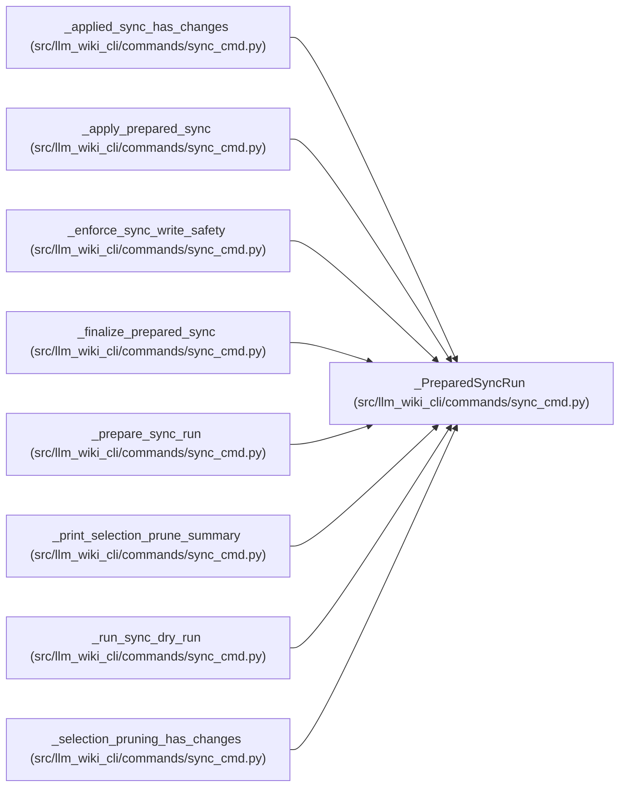

# _PreparedSyncRun

**Location:** `src/llm_wiki_cli/commands/sync_cmd.py:1689`
**Kind:** Class
**Bases:** —
**Module:** [sync_cmd](../modules/sync_cmd.md)

**Decorators:** `@dataclass(frozen=True)`

## Description

Immutable handoff from sync preparation to safety checks and application. It
keeps the validated manifest, live inventory and source snapshot, public and
application diffs, canonical page maps, optional-surface and infrastructure
plans, graph observations, and the flags that distinguish seeding, repair, or a
runtime-basis refresh. Keeping this state together prevents later steps from
recomputing against a different source tree.

## Attributes

| Name | Type | Default | Description |
|------|------|---------|-------------|
| `manifest` | `'SyncManifest'` | *required* | — |
| `seed_manifest` | `bool` | *required* | — |
| `repair_only` | `bool` | *required* | — |
| `inventory_result` | `InventoryResult` | *required* | — |
| `source_snapshot` | `SourceSnapshot` | *required* | — |
| `inventory` | `dict` | *required* | — |
| `page_maps` | `_SyncPageMaps` | *required* | — |
| `diff` | `'SyncDiff'` | *required* | — |
| `application_diff` | `'SyncDiff'` | *required* | — |
| `surface_plan` | `_SurfaceInitializationPlan` | *required* | — |
| `repository_evidence` | `RepositoryEvidence` | *required* | — |
| `graph_observations` | `_RuntimeGraphObservations` | *required* | — |
| `infrastructure_plan` | `InfrastructureSyncPlan` | *required* | — |
| `source_selection_prune` | `SourceSelectionPruneResult` | *required* | — |
| `runtime_provenance_changed` | `bool` | *required* | — |
| `generator_refresh_required` | `bool` | *required* | — |
| `runtime_basis_refresh` | `bool` | *required* | — |
| `log_missing` | `bool` | *required* | — |

## Methods

*No public methods. Inherits from base classes.*

## Relationships

<!-- Auto-generated relationship summary. Do not edit by hand. -->

### Summary

| Module | Methods | Attributes |
|---|---:|---|
| [sync_cmd](../modules/sync_cmd.md) | 0 | `application_diff`, `diff`, `generator_refresh_required`, `graph_observations`, `infrastructure_plan`, `inventory`, `inventory_result`, `log_missing`, `manifest`, `page_maps`, `repair_only`, `repository_evidence` |

### References

| Reference | Kind | Source | Call sites |
|---|---|---|---:|
| `_applied_sync_has_changes` | type_reference | [sync_cmd](../modules/sync_cmd.md) | — |
| `_apply_prepared_sync` | type_reference | [sync_cmd](../modules/sync_cmd.md) | — |
| `_enforce_sync_write_safety` | type_reference | [sync_cmd](../modules/sync_cmd.md) | — |
| `_finalize_prepared_sync` | type_reference | [sync_cmd](../modules/sync_cmd.md) | — |
| `_prepare_sync_run` | call | [sync_cmd](../modules/sync_cmd.md) | 1 |
| `_prepare_sync_run` | type_reference | [sync_cmd](../modules/sync_cmd.md) | — |
| `_print_selection_prune_summary` | type_reference | [sync_cmd](../modules/sync_cmd.md) | — |
| `_run_sync_dry_run` | type_reference | [sync_cmd](../modules/sync_cmd.md) | — |
| `_selection_pruning_has_changes` | type_reference | [sync_cmd](../modules/sync_cmd.md) | — |
