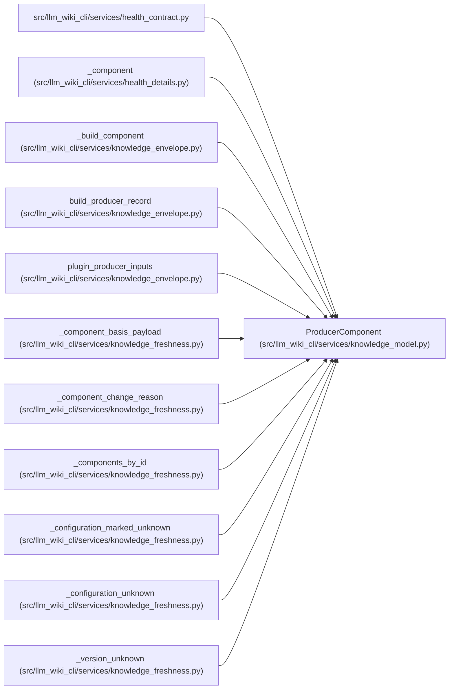

# ProducerComponent

**Location:** `src/llm_wiki_cli/services/knowledge_model.py:302`
**Kind:** Class
**Bases:** —
**Module:** [knowledge_model](../modules/knowledge_model.md)

**Decorators:** `@dataclass(frozen=True)`

## Description

_Auto-generated from `ProducerComponent` in `src/llm_wiki_cli/services/knowledge_model.py`._

## Attributes

| Name | Type | Default | Description |
|------|------|---------|-------------|
| `component_id` | `str` | *required* | — |
| `version` | `str` | *required* | — |
| `configuration_hash` | `Optional[str]` | `None` | — |
| `limitations` | `tuple[str, ...]` | `()` | — |
| `extensions` | `Extensions` | `field(default_factory=dict)` | — |

## Methods

*No public methods. Inherits from base classes.*

## Relationships

<!-- Auto-generated relationship summary. Do not edit by hand. -->

### Summary

| Module | Methods | Attributes |
|---|---:|---|
| [knowledge_model](../modules/knowledge_model.md) | 0 | `component_id`, `configuration_hash`, `extensions`, `limitations`, `version` |

### References

| Reference | Kind | Source | Call sites |
|---|---|---|---:|
| `health_contract` | import | [health_contract](../modules/health_contract.md) | — |
| `_component` | type_reference | [health_details](../modules/health_details.md) | — |
| `_build_component` | call | [knowledge_envelope](../modules/knowledge_envelope.md) | 1 |
| `_build_component` | type_reference | [knowledge_envelope](../modules/knowledge_envelope.md) | — |
| `build_producer_record` | type_reference | [knowledge_envelope](../modules/knowledge_envelope.md) | — |
| `plugin_producer_inputs` | type_reference | [knowledge_envelope](../modules/knowledge_envelope.md) | — |
| `_component_basis_payload` | type_reference | [knowledge_freshness](../modules/knowledge_freshness.md) | — |
| `_component_change_reason` | type_reference | [knowledge_freshness](../modules/knowledge_freshness.md) | — |
| `_components_by_id` | type_reference | [knowledge_freshness](../modules/knowledge_freshness.md) | — |
| `_configuration_marked_unknown` | type_reference | [knowledge_freshness](../modules/knowledge_freshness.md) | — |
| `_configuration_unknown` | type_reference | [knowledge_freshness](../modules/knowledge_freshness.md) | — |
| `_version_unknown` | type_reference | [knowledge_freshness](../modules/knowledge_freshness.md) | — |

> References: showing 12 of 19 logical references; 7 omitted by the 12-row generated summary limit.
