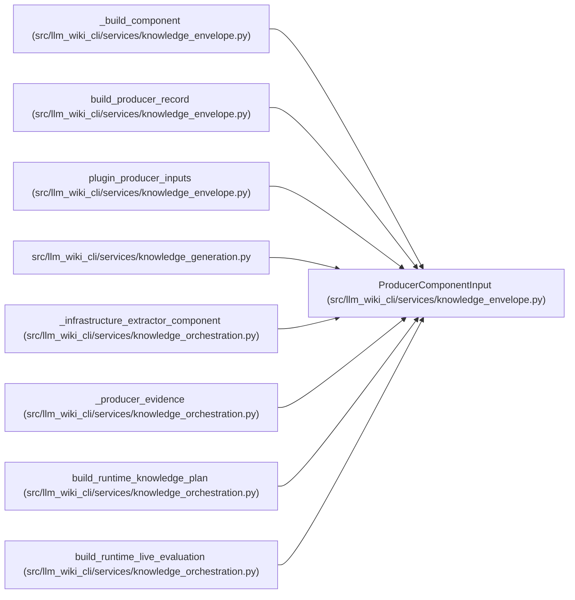

# ProducerComponentInput

**Location:** `src/llm_wiki_cli/services/knowledge_envelope.py:215`
**Kind:** Class
**Bases:** —
**Module:** [knowledge_envelope](../modules/knowledge_envelope.md)

**Decorators:** `@dataclass(frozen=True)`

## Description

Safe, already selected producer metadata.

``configuration`` must be an application-owned allowlist of effective,
non-secret, behavior-affecting values.  ``None`` explicitly means that the
complete safe configuration basis was unavailable.

## Attributes

| Name | Type | Default | Description |
|------|------|---------|-------------|
| `component_id` | `str` | *required* | — |
| `version` | `str \| None` | *required* | — |
| `configuration` | `Mapping[str, Any] \| None` | `None` | — |
| `limitations` | `tuple[str, ...]` | `()` | — |
| `extensions` | `Mapping[str, Any]` | `field(default_factory=dict)` | — |

## Methods

*No public methods. Inherits from base classes.*

## Relationships

<!-- Auto-generated relationship summary. Do not edit by hand. -->

### Summary

| Module | Methods | Attributes |
|---|---:|---|
| [knowledge_envelope](../modules/knowledge_envelope.md) | 0 | `component_id`, `configuration`, `extensions`, `limitations`, `version` |

### References

| Reference | Kind | Source |
|---|---|---|
| `_build_component` | type_reference | [knowledge_envelope](../modules/knowledge_envelope.md) |
| `build_producer_record` | type_reference | [knowledge_envelope](../modules/knowledge_envelope.md) |
| `plugin_producer_inputs` | call | [knowledge_envelope](../modules/knowledge_envelope.md) |
| `plugin_producer_inputs` | type_reference | [knowledge_envelope](../modules/knowledge_envelope.md) |
| `knowledge_generation` | import | [knowledge_generation](../modules/knowledge_generation.md) |
| `_infrastructure_extractor_component` | call | [knowledge_orchestration](../modules/knowledge_orchestration.md) |
| `_infrastructure_extractor_component` | type_reference | [knowledge_orchestration](../modules/knowledge_orchestration.md) |
| `_producer_evidence` | call | [knowledge_orchestration](../modules/knowledge_orchestration.md) |
| `_producer_evidence` | call | [knowledge_orchestration](../modules/knowledge_orchestration.md) |
| `_producer_evidence` | type_reference | [knowledge_orchestration](../modules/knowledge_orchestration.md) |
| `build_runtime_knowledge_plan` | call | [knowledge_orchestration](../modules/knowledge_orchestration.md) |
| `build_runtime_live_evaluation` | call | [knowledge_orchestration](../modules/knowledge_orchestration.md) |
