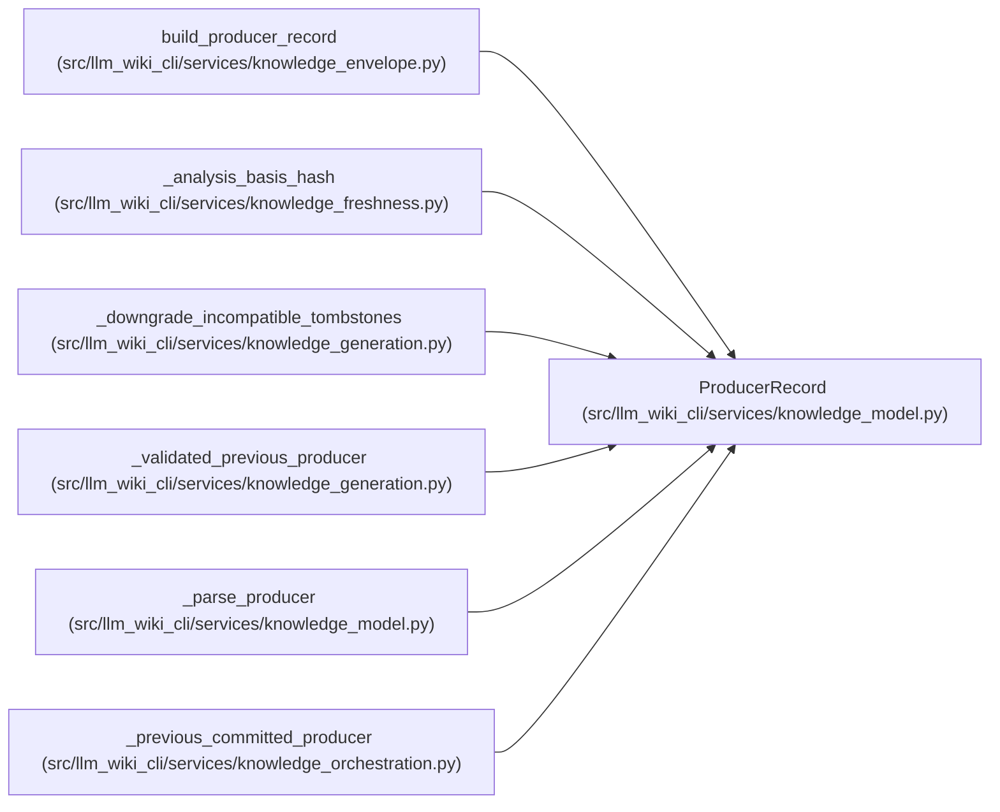

# ProducerRecord

**Location:** `src/llm_wiki_cli/services/knowledge_model.py:311`
**Kind:** Class
**Bases:** —
**Module:** [knowledge_model](../modules/knowledge_model.md)

**Decorators:** `@dataclass(frozen=True)`

## Description

_Auto-generated from `ProducerRecord` in `src/llm_wiki_cli/services/knowledge_model.py`._

## Attributes

| Name | Type | Default | Description |
|------|------|---------|-------------|
| `tool` | `ProducerComponent` | *required* | — |
| `extractors` | `tuple[ProducerComponent, ...]` | `()` | — |
| `plugins` | `tuple[ProducerComponent, ...]` | `()` | — |
| `extensions` | `Extensions` | `field(default_factory=dict)` | — |

## Methods

*No public methods. Inherits from base classes.*

## Relationships

<!-- Auto-generated relationship summary. Do not edit by hand. -->

### Summary

| Module | Methods | Attributes |
|---|---:|---|
| [knowledge_model](../modules/knowledge_model.md) | 0 | `extensions`, `extractors`, `plugins`, `tool` |

### References

| Reference | Kind | Source | Call sites |
|---|---|---|---:|
| `build_producer_record` | call | [knowledge_envelope](../modules/knowledge_envelope.md) | 1 |
| `build_producer_record` | type_reference | [knowledge_envelope](../modules/knowledge_envelope.md) | — |
| `_analysis_basis_hash` | type_reference | [knowledge_freshness](../modules/knowledge_freshness.md) | — |
| `_downgrade_incompatible_tombstones` | type_reference | [knowledge_generation](../modules/knowledge_generation.md) | — |
| `_validated_previous_producer` | type_reference | [knowledge_generation](../modules/knowledge_generation.md) | — |
| `_parse_producer` | call | [knowledge_model](../modules/knowledge_model.md) | 1 |
| `_parse_producer` | type_reference | [knowledge_model](../modules/knowledge_model.md) | — |
| `_previous_committed_producer` | type_reference | [knowledge_orchestration](../modules/knowledge_orchestration.md) | — |
