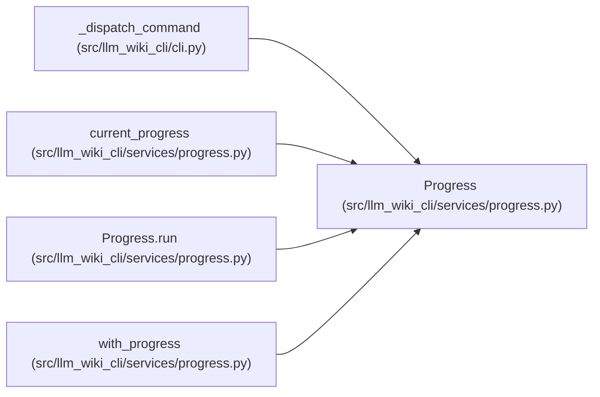

# Progress

**Location:** `src/llm_wiki_cli/services/progress.py:48`
**Kind:** Class
**Bases:** —
**Module:** [progress](../modules/progress.md)

## Description

One lightweight heartbeat worker and one bounded stream per command.

## Attributes

*No annotated attributes found.*

## Methods

| Method | Signature | Decorators | Description |
|--------|-----------|------------|-------------|
| `__init__` | `(command: str, *, mode: str = 'auto', output_format: str = 'text', stream: TextIO \| None = None, clock: Callable[[], float] = time.perf_counter, interval: float = 10.0, start_thread: bool = True)` | — | — |
| `_emit` | `(event: str, phase: str \| None = None, elapsed_ms: int \| None = None) -> None` | — | — |
| `_announce` | `() -> None` | — | — |
| `tick` | `() -> None` | — | Emit a due heartbeat; injectable clocks need no real waiting in tests. |
| `_heartbeat` | `() -> None` | — | — |
| `phase` | `(name: str) -> Iterator[Phase]` | `@contextmanager` | — |
| `run` | `() -> Iterator[Progress]` | `@contextmanager` | — |

## Relationships

<!-- Auto-generated relationship summary. Do not edit by hand. -->

### Summary

| Module | Methods | Attributes |
|---|---:|---|
| [progress](../modules/progress.md) | 7 | — |

### References

| Reference | Kind | Source | Call sites |
|---|---|---|---:|
| `_dispatch_command` | call | [cli](../modules/cli.md) | 1 |
| `current_progress` | type_reference | [progress](../modules/progress.md) | — |
| `Progress.run` | type_reference | [progress](../modules/progress.md) | — |
| `with_progress` | type_reference | [progress](../modules/progress.md) | — |
