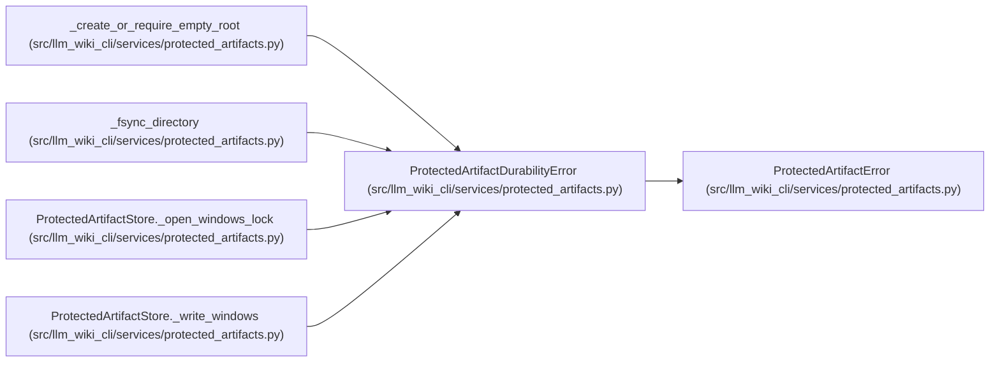

# ProtectedArtifactDurabilityError

**Location:** `src/llm_wiki_cli/services/protected_artifacts.py:91`
**Kind:** Class
**Bases:** `ProtectedArtifactError`
**Module:** [protected_artifacts](../modules/protected_artifacts.md)

## Description

Raised when committed filesystem metadata cannot be made durable.

## Attributes

*No annotated attributes found.*

## Methods

*No public methods. Inherits from base classes.*

## Relationships

<!-- Auto-generated relationship summary. Do not edit by hand. -->

### Summary

| Module | Methods | Attributes |
|---|---:|---|
| [protected_artifacts](../modules/protected_artifacts.md) | 0 | — |

### Structure

| Kind | Entity | Module |
|---|---|---|
| Base | `ProtectedArtifactError` | [protected_artifacts](../modules/protected_artifacts.md) |

### References

| Reference | Kind | Source |
|---|---|---|
| `_create_or_require_empty_root` | call | [protected_artifacts](../modules/protected_artifacts.md) |
| `_fsync_directory` | call | [protected_artifacts](../modules/protected_artifacts.md) |
| `ProtectedArtifactStore._open_windows_lock` | call | [protected_artifacts](../modules/protected_artifacts.md) |
| `ProtectedArtifactStore._write_windows` | call | [protected_artifacts](../modules/protected_artifacts.md) |
