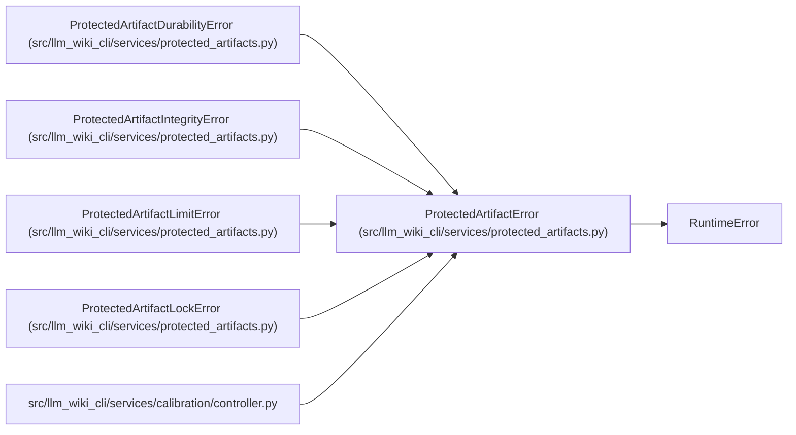

# ProtectedArtifactError

**Location:** `src/llm_wiki_cli/services/protected_artifacts.py:75`
**Kind:** Class
**Bases:** `RuntimeError`
**Module:** [protected_artifacts](../modules/protected_artifacts.md)

## Description

Base error for protected artifact storage.

## Attributes

*No annotated attributes found.*

## Methods

*No public methods. Inherits from base classes.*

## Relationships

<!-- Auto-generated relationship summary. Do not edit by hand. -->

### Summary

| Module | Methods | Attributes |
|---|---:|---|
| [protected_artifacts](../modules/protected_artifacts.md) | 0 | — |

### Structure

| Kind | Entity | Module |
|---|---|---|
| Base | `RuntimeError` | — |
| Subclass | `ProtectedArtifactDurabilityError` | [protected_artifacts](../modules/protected_artifacts.md) |
| Subclass | `ProtectedArtifactIntegrityError` | [protected_artifacts](../modules/protected_artifacts.md) |
| Subclass | `ProtectedArtifactLimitError` | [protected_artifacts](../modules/protected_artifacts.md) |
| Subclass | `ProtectedArtifactLockError` | [protected_artifacts](../modules/protected_artifacts.md) |

### References

| Reference | Kind | Source |
|---|---|---|
| `controller` | import | [controller](../modules/controller.md) |
