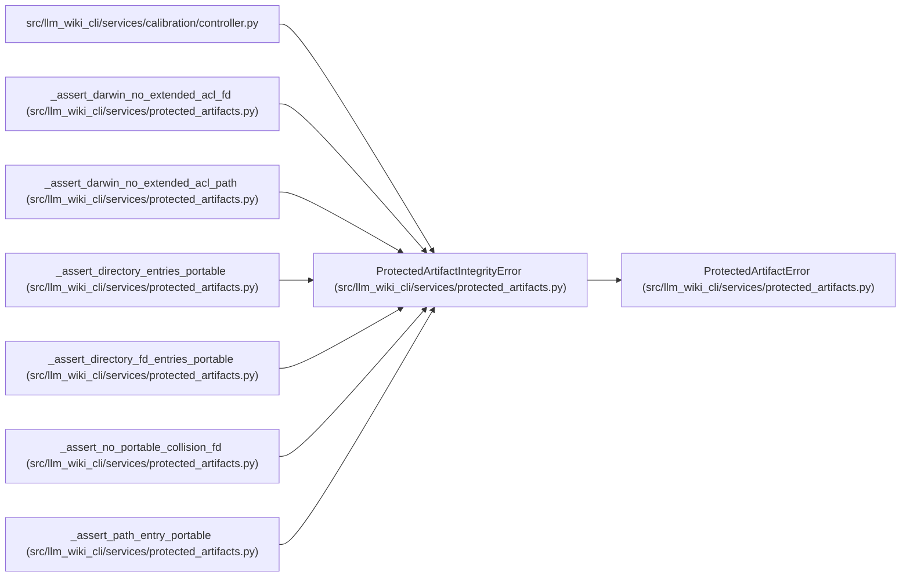

# ProtectedArtifactIntegrityError

**Location:** `src/llm_wiki_cli/services/protected_artifacts.py:79`
**Kind:** Class
**Bases:** `ProtectedArtifactError`
**Module:** [protected_artifacts](../modules/protected_artifacts.md)

## Description

Raised when artifact filesystem or canonical-byte invariants fail.

## Attributes

*No annotated attributes found.*

## Methods

*No public methods. Inherits from base classes.*

## Relationships

<!-- Auto-generated relationship summary. Do not edit by hand. -->

### Summary

| Module | Methods | Attributes |
|---|---:|---|
| [protected_artifacts](../modules/protected_artifacts.md) | 0 | — |

### Structure

| Kind | Entity | Module |
|---|---|---|
| Base | `ProtectedArtifactError` | [protected_artifacts](../modules/protected_artifacts.md) |

### References

| Reference | Kind | Source |
|---|---|---|
| `controller` | import | [controller](../modules/controller.md) |
| `_assert_darwin_no_extended_acl_fd` | call | [protected_artifacts](../modules/protected_artifacts.md) |
| `_assert_darwin_no_extended_acl_path` | call | [protected_artifacts](../modules/protected_artifacts.md) |
| `_assert_darwin_no_extended_acl_path` | call | [protected_artifacts](../modules/protected_artifacts.md) |
| `_assert_darwin_no_extended_acl_path` | call | [protected_artifacts](../modules/protected_artifacts.md) |
| `_assert_darwin_no_extended_acl_path` | call | [protected_artifacts](../modules/protected_artifacts.md) |
| `_assert_directory_entries_portable` | call | [protected_artifacts](../modules/protected_artifacts.md) |
| `_assert_directory_fd_entries_portable` | call | [protected_artifacts](../modules/protected_artifacts.md) |
| `_assert_no_portable_collision_fd` | call | [protected_artifacts](../modules/protected_artifacts.md) |
| `_assert_no_portable_collision_fd` | call | [protected_artifacts](../modules/protected_artifacts.md) |
| `_assert_path_entry_portable` | call | [protected_artifacts](../modules/protected_artifacts.md) |
| `_assert_path_entry_portable` | call | [protected_artifacts](../modules/protected_artifacts.md) |
