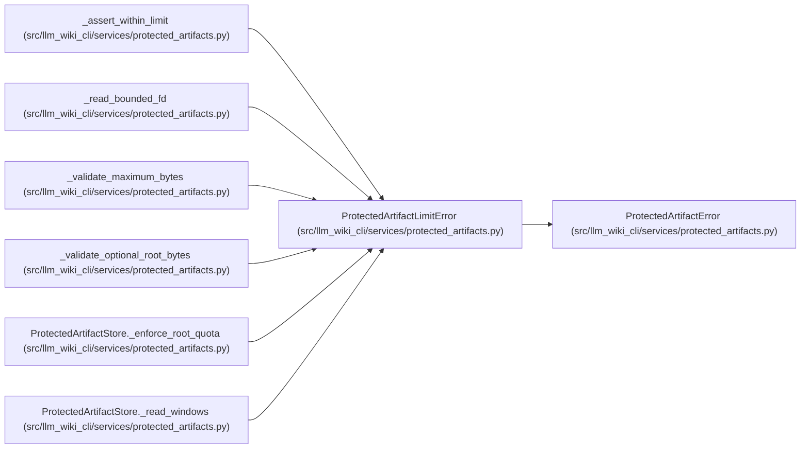

# ProtectedArtifactLimitError

**Location:** `src/llm_wiki_cli/services/protected_artifacts.py:83`
**Kind:** Class
**Bases:** `ProtectedArtifactError`
**Module:** [protected_artifacts](../modules/protected_artifacts.md)

## Description

Raised when an artifact or protected root exceeds its byte limit.

## Attributes

*No annotated attributes found.*

## Methods

*No public methods. Inherits from base classes.*

## Relationships

<!-- Auto-generated relationship summary. Do not edit by hand. -->

### Summary

| Module | Methods | Attributes |
|---|---:|---|
| [protected_artifacts](../modules/protected_artifacts.md) | 0 | — |

### Structure

| Kind | Entity | Module |
|---|---|---|
| Base | `ProtectedArtifactError` | [protected_artifacts](../modules/protected_artifacts.md) |

### References

| Reference | Kind | Source |
|---|---|---|
| `_assert_within_limit` | call | [protected_artifacts](../modules/protected_artifacts.md) |
| `_read_bounded_fd` | call | [protected_artifacts](../modules/protected_artifacts.md) |
| `_read_bounded_fd` | call | [protected_artifacts](../modules/protected_artifacts.md) |
| `_validate_maximum_bytes` | call | [protected_artifacts](../modules/protected_artifacts.md) |
| `_validate_optional_root_bytes` | call | [protected_artifacts](../modules/protected_artifacts.md) |
| `ProtectedArtifactStore._enforce_root_quota` | call | [protected_artifacts](../modules/protected_artifacts.md) |
| `ProtectedArtifactStore._read_windows` | call | [protected_artifacts](../modules/protected_artifacts.md) |
| `ProtectedArtifactStore._read_windows` | call | [protected_artifacts](../modules/protected_artifacts.md) |
