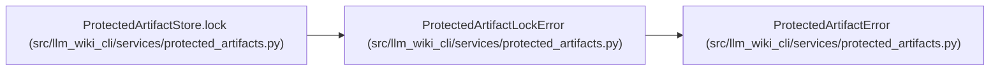

# ProtectedArtifactLockError

**Location:** `src/llm_wiki_cli/services/protected_artifacts.py:87`
**Kind:** Class
**Bases:** `ProtectedArtifactError`
**Module:** [protected_artifacts](../modules/protected_artifacts.md)

## Description

Raised when the controller root lock cannot be acquired.

## Attributes

*No annotated attributes found.*

## Methods

*No public methods. Inherits from base classes.*

## Relationships

<!-- Auto-generated relationship summary. Do not edit by hand. -->

### Summary

| Module | Methods | Attributes |
|---|---:|---|
| [protected_artifacts](../modules/protected_artifacts.md) | 0 | — |

### Structure

| Kind | Entity | Module |
|---|---|---|
| Base | `ProtectedArtifactError` | [protected_artifacts](../modules/protected_artifacts.md) |

### References

| Reference | Kind | Source | Call sites |
|---|---|---|---:|
| `ProtectedArtifactStore.lock` | call | [protected_artifacts](../modules/protected_artifacts.md) | 2 |
