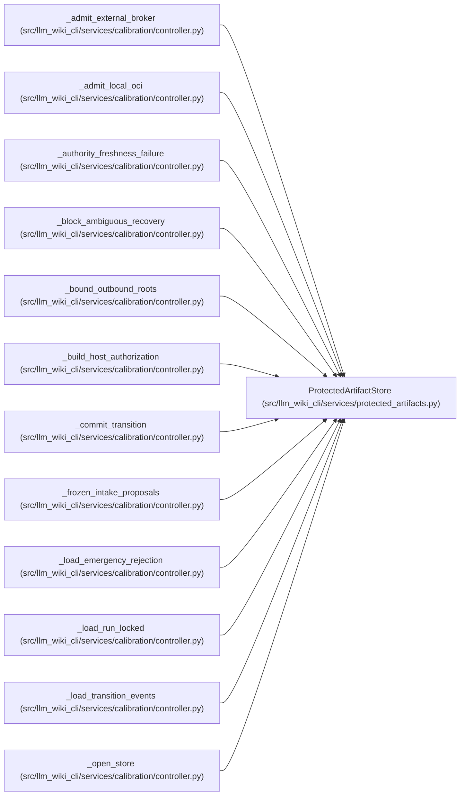

# ProtectedArtifactStore

**Location:** `src/llm_wiki_cli/services/protected_artifacts.py:149`
**Kind:** Class
**Bases:** —
**Module:** [protected_artifacts](../modules/protected_artifacts.md)

## Description

A reusable same-user application-level artifact store rooted at one directory.

``max_root_bytes`` optionally bounds the cumulative committed artifact
payload under the root. The controller lock is coordination metadata and
does not count toward that quota. Quota-bearing writes claim that lock
around both accounting and commit, and the lock is reentrant on its owning
thread so callers may still group transitions in ``with store.lock()``.

This quota is an application-level contract for store instances configured
with the same limit. The same-user filesystem owner can bypass it through
direct I/O or an unbounded store, consistent with this module's trust model.

## Attributes

*No annotated attributes found.*

## Methods

| Method | Signature | Decorators | Description |
|--------|-----------|------------|-------------|
| `__init__` | `(root: str \| Path, *, create: bool = False, max_root_bytes: int \| None = None) -> None` | — | — |
| `root` | `() -> Path` | `@property` | Return the resolved protected root. |
| `max_root_bytes` | `() -> int \| None` | `@property` | Return the cumulative artifact quota, or ``None`` when disabled. |
| `verify_host_protection` | `() -> None` | — | Fail closed unless the complete store has supported host protection. |
| `verify_access_protection` | `() -> dict[str, str]` | — | Verify protection and return host-derived admission evidence. |
| `lock` | `() -> Iterator[None]` | `@contextmanager` | Acquire the dedicated controller lock without waiting. |
| `exists` | `(relative: str \| Path) -> bool` | — | Return whether a regular protected artifact exists. |
| `read_json` | `(relative: str \| Path, *, max_bytes: int = DEFAULT_MAX_ARTIFACT_BYTES) -> dict[str, Any]` | — | Read one bounded canonical JSON object. |
| `read_text` | `(relative: str \| Path, *, max_bytes: int = DEFAULT_MAX_PROJECTION_BYTES) -> str` | — | Read one bounded UTF-8 text artifact. |
| `write_immutable_json` | `(relative: str \| Path, payload: Mapping[str, Any], *, max_bytes: int = DEFAULT_MAX_ARTIFACT_BYTES) -> Path` | — | Atomically create one application-level immutable JSON artifact. |
| `write_snapshot_json` | `(relative: str \| Path, payload: Mapping[str, Any], *, max_bytes: int = DEFAULT_MAX_ARTIFACT_BYTES) -> Path` | — | Atomically replace one mutable canonical JSON snapshot. |
| `write_projection_text` | `(relative: str \| Path, text: str, *, max_bytes: int = DEFAULT_MAX_PROJECTION_BYTES) -> Path` | — | Atomically replace one bounded UTF-8 text projection. |
| `_assert_root_current` | `() -> None` | — | — |
| `_verify_windows_tree` | `(*, target_parts: tuple[str, ...] \| None = None) -> tuple[int, int]` | — | — |
| `_read_bytes` | `(portable: str, *, maximum_bytes: int, existence_only: bool = False) -> bytes` | — | — |
| `_write_bytes` | `(portable: str, data: bytes, *, immutable: bool) -> None` | — | — |
| `_write_bytes_once` | `(portable: str, data: bytes, *, immutable: bool) -> None` | — | — |
| `_enforce_root_quota` | `(parts: tuple[str, ...], data: bytes, *, immutable: bool) -> bool` | — | — |
| `_read_posix` | `(parts: Sequence[str], maximum_bytes: int, existence_only: bool) -> bytes` | — | — |
| `_read_windows` | `(parts: Sequence[str], maximum_bytes: int, existence_only: bool) -> bytes` | — | — |
| `_write_posix` | `(parts: Sequence[str], data: bytes, *, immutable: bool) -> None` | — | — |
| `_write_windows` | `(parts: Sequence[str], data: bytes, *, immutable: bool) -> None` | — | — |
| `_open_posix_parent` | `(parts: Sequence[str], *, create: bool) -> Iterator[tuple[int, str]]` | `@contextmanager` | — |
| `_existing_windows_parent` | `(components: Sequence[str]) -> Path` | — | — |
| `_open_posix_lock` | `() -> int` | — | — |
| `_open_windows_lock` | `() -> int` | — | — |

## Relationships

<!-- Auto-generated relationship summary. Do not edit by hand. -->

### Summary

| Module | Methods | Attributes |
|---|---:|---|
| [protected_artifacts](../modules/protected_artifacts.md) | 26 | — |

### References

| Reference | Kind | Source | Call sites |
|---|---|---|---:|
| `_admit_external_broker` | type_reference | [controller](../modules/controller.md) | — |
| `_admit_local_oci` | type_reference | [controller](../modules/controller.md) | — |
| `_authority_freshness_failure` | type_reference | [controller](../modules/controller.md) | — |
| `_block_ambiguous_recovery` | type_reference | [controller](../modules/controller.md) | — |
| `_bound_outbound_roots` | type_reference | [controller](../modules/controller.md) | — |
| `_build_host_authorization` | type_reference | [controller](../modules/controller.md) | — |
| `_commit_transition` | type_reference | [controller](../modules/controller.md) | — |
| `_frozen_intake_proposals` | type_reference | [controller](../modules/controller.md) | — |
| `_load_emergency_rejection` | type_reference | [controller](../modules/controller.md) | — |
| `_load_run_locked` | type_reference | [controller](../modules/controller.md) | — |
| `_load_transition_events` | type_reference | [controller](../modules/controller.md) | — |
| `_open_store` | call | [controller](../modules/controller.md) | 1 |

> References: showing 12 of 24 logical references; 12 omitted by the 12-row generated summary limit.
