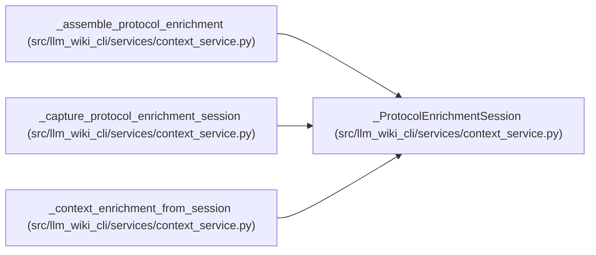

# _ProtocolEnrichmentSession

**Location:** `src/llm_wiki_cli/services/context_service.py:1731`
**Kind:** Class
**Bases:** —
**Module:** [context_service](../modules/context_service.md)

**Decorators:** `@dataclass(frozen=True)`

## Description

Operation-scoped query state captured from one knowledge read.

## Attributes

| Name | Type | Default | Description |
|------|------|---------|-------------|
| `query_surface` | `dict[str, Any]` | *required* | — |
| `query_service` | `DocumentationGraphQueryService` | *required* | — |
| `knowledge_view` | `KnowledgeReadView \| None` | *required* | — |

## Methods

*No public methods. Inherits from base classes.*

## Relationships

<!-- Auto-generated relationship summary. Do not edit by hand. -->

### Summary

| Module | Methods | Attributes |
|---|---:|---|
| [context_service](../modules/context_service.md) | 0 | `knowledge_view`, `query_service`, `query_surface` |

### References

| Reference | Kind | Source | Call sites |
|---|---|---|---:|
| `_assemble_protocol_enrichment` | type_reference | [context_service](../modules/context_service.md) | — |
| `_capture_protocol_enrichment_session` | call | [context_service](../modules/context_service.md) | 1 |
| `_capture_protocol_enrichment_session` | type_reference | [context_service](../modules/context_service.md) | — |
| `_context_enrichment_from_session` | type_reference | [context_service](../modules/context_service.md) | — |
