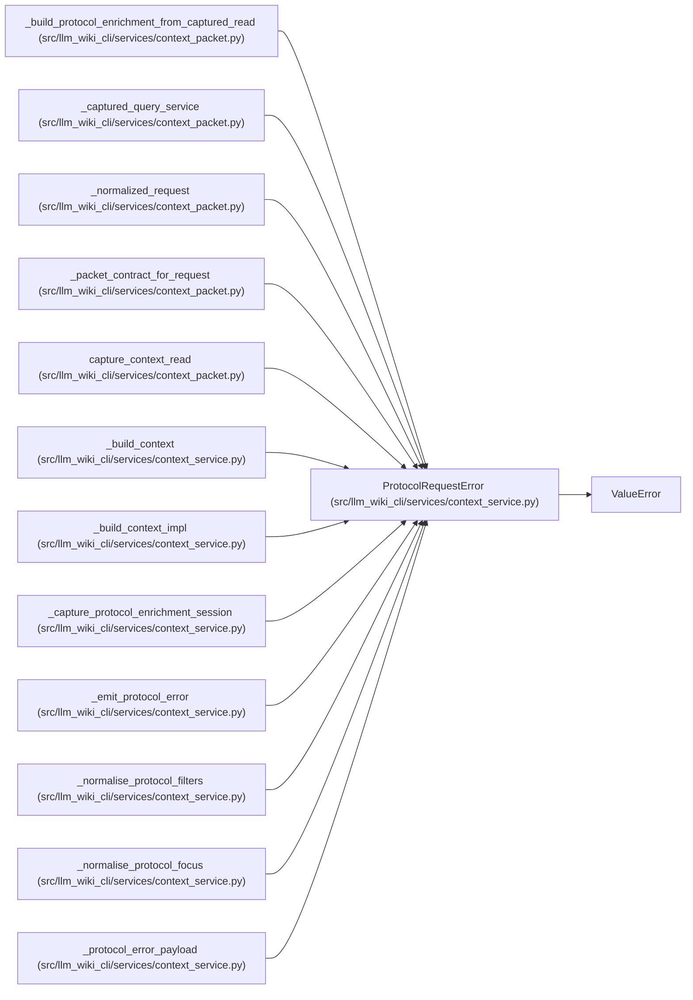

# ProtocolRequestError

**Location:** `src/llm_wiki_cli/services/context_service.py:176`
**Kind:** Class
**Bases:** `ValueError`
**Module:** [context_service](../modules/context_service.md)

## Description

Validation error for Wiki-as-Context protocol requests.

## Attributes

*No annotated attributes found.*

## Methods

| Method | Signature | Decorators | Description |
|--------|-----------|------------|-------------|
| `__init__` | `(message: str, field: str \| None = None, *, protocol: str = PROTOCOL_VERSION)` | — | — |

## Relationships

<!-- Auto-generated relationship summary. Do not edit by hand. -->

### Summary

| Module | Methods | Attributes |
|---|---:|---|
| [context_service](../modules/context_service.md) | 1 | — |

### Structure

| Kind | Entity | Module |
|---|---|---|
| Base | `ValueError` | — |

### References

| Reference | Kind | Source | Call sites |
|---|---|---|---:|
| `_build_protocol_enrichment_from_captured_read` | call | [context_packet](../modules/context_packet.md) | 1 |
| `_captured_query_service` | call | [context_packet](../modules/context_packet.md) | 1 |
| `_normalized_request` | call | [context_packet](../modules/context_packet.md) | 1 |
| `_packet_contract_for_request` | call | [context_packet](../modules/context_packet.md) | 1 |
| `capture_context_read` | call | [context_packet](../modules/context_packet.md) | 7 |
| `_build_context` | call | [context_service](../modules/context_service.md) | 1 |
| `_build_context_impl` | call | [context_service](../modules/context_service.md) | 8 |
| `_capture_protocol_enrichment_session` | call | [context_service](../modules/context_service.md) | 4 |
| `_emit_protocol_error` | type_reference | [context_service](../modules/context_service.md) | — |
| `_normalise_protocol_filters` | call | [context_service](../modules/context_service.md) | 6 |
| `_normalise_protocol_focus` | call | [context_service](../modules/context_service.md) | 6 |
| `_protocol_error_payload` | type_reference | [context_service](../modules/context_service.md) | — |

> References: showing 12 of 19 logical references; 7 omitted by the 12-row generated summary limit.
