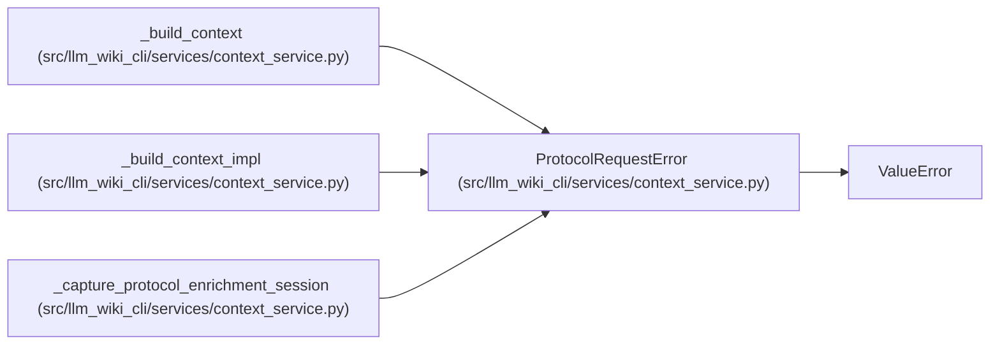

# ProtocolRequestError

**Location:** `src/llm_wiki_cli/services/context_service.py:176`
**Kind:** Class
**Bases:** `ValueError`
**Module:** [context_service](../modules/context_service.md)

## Description

Validation error for Wiki-as-Context protocol requests.

## Attributes

*No annotated attributes found.*

## Methods

| Method | Signature | Decorators | Description |
|--------|-----------|------------|-------------|
| `__init__` | `(message: str, field: str \| None = None, *, protocol: str = PROTOCOL_VERSION)` | — | — |

## Relationships

<!-- Auto-generated relationship summary. Do not edit by hand. -->

### Summary

| Module | Methods | Attributes |
|---|---:|---|
| [context_service](../modules/context_service.md) | 1 | — |

### Structure

| Kind | Entity | Module |
|---|---|---|
| Base | `ValueError` | — |

### References

| Reference | Kind | Source |
|---|---|---|
| `_build_context` | call | [context_service](../modules/context_service.md) |
| `_build_context_impl` | call | [context_service](../modules/context_service.md) |
| `_build_context_impl` | call | [context_service](../modules/context_service.md) |
| `_build_context_impl` | call | [context_service](../modules/context_service.md) |
| `_build_context_impl` | call | [context_service](../modules/context_service.md) |
| `_build_context_impl` | call | [context_service](../modules/context_service.md) |
| `_build_context_impl` | call | [context_service](../modules/context_service.md) |
| `_build_context_impl` | call | [context_service](../modules/context_service.md) |
| `_build_context_impl` | call | [context_service](../modules/context_service.md) |
| `_capture_protocol_enrichment_session` | call | [context_service](../modules/context_service.md) |
| `_capture_protocol_enrichment_session` | call | [context_service](../modules/context_service.md) |
| `_capture_protocol_enrichment_session` | call | [context_service](../modules/context_service.md) |
