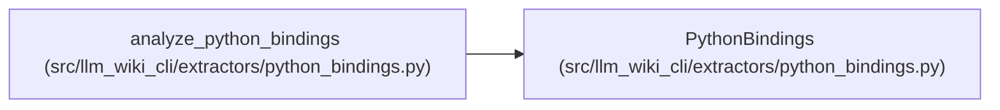

# PythonBindings

**Location:** `src/llm_wiki_cli/extractors/python_bindings.py:144`
**Kind:** Class
**Bases:** —
**Module:** [python_bindings](../modules/python_bindings.md)

**Decorators:** `@dataclass(frozen=True)`

## Description

_Auto-generated from `PythonBindings` in `src/llm_wiki_cli/extractors/python_bindings.py`._

## Attributes

| Name | Type | Default | Description |
|------|------|---------|-------------|
| `module` | `dict[str, dict]` | *required* | — |
| `calls` | `dict[int, dict]` | *required* | — |

## Methods

*No public methods. Inherits from base classes.*

## Relationships

<!-- Auto-generated relationship summary. Do not edit by hand. -->

### Summary

| Module | Methods | Attributes |
|---|---:|---|
| [python_bindings](../modules/python_bindings.md) | 0 | `calls`, `module` |

### References

| Reference | Kind | Source | Call sites |
|---|---|---|---:|
| `analyze_python_bindings` | call | [python_bindings](../modules/python_bindings.md) | 1 |
| `analyze_python_bindings` | type_reference | [python_bindings](../modules/python_bindings.md) | — |
