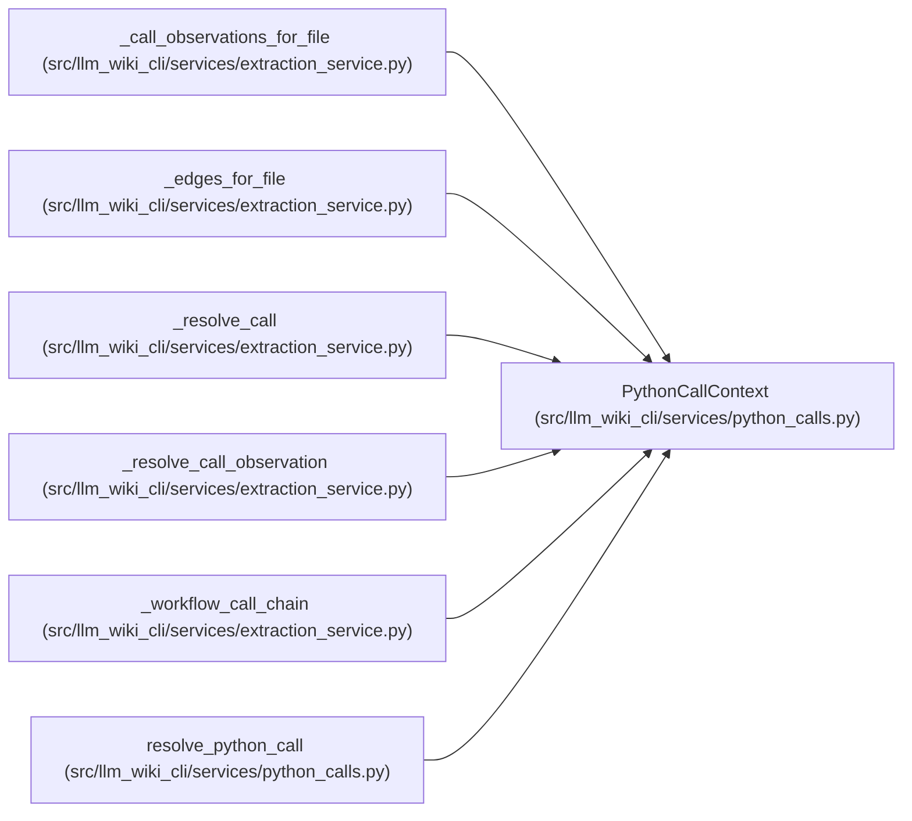

# PythonCallContext

**Location:** `src/llm_wiki_cli/services/python_calls.py:14`
**Kind:** Class
**Bases:** —
**Module:** [python_calls](../modules/python_calls.md)

**Decorators:** `@dataclass(frozen=True)`

## Description

_Auto-generated from `PythonCallContext` in `src/llm_wiki_cli/services/python_calls.py`._

## Attributes

| Name | Type | Default | Description |
|------|------|---------|-------------|
| `callable` | `dict` | *required* | — |
| `call_index` | `int` | *required* | — |
| `resolver` | `ModulePathResolver` | *required* | — |
| `class_name` | `str \| None` | `None` | — |

## Methods

*No public methods. Inherits from base classes.*

## Relationships

<!-- Auto-generated relationship summary. Do not edit by hand. -->

### Summary

| Module | Methods | Attributes |
|---|---:|---|
| [python_calls](../modules/python_calls.md) | 0 | `call_index`, `callable`, `class_name`, `resolver` |

### References

| Reference | Kind | Source | Call sites |
|---|---|---|---:|
| `_call_observations_for_file` | call | [extraction_service](../modules/extraction_service.md) | 1 |
| `_edges_for_file` | call | [extraction_service](../modules/extraction_service.md) | 1 |
| `_resolve_call` | type_reference | [extraction_service](../modules/extraction_service.md) | — |
| `_resolve_call_observation` | type_reference | [extraction_service](../modules/extraction_service.md) | — |
| `_workflow_call_chain` | call | [extraction_service](../modules/extraction_service.md) | 1 |
| `resolve_python_call` | type_reference | [python_calls](../modules/python_calls.md) | — |
