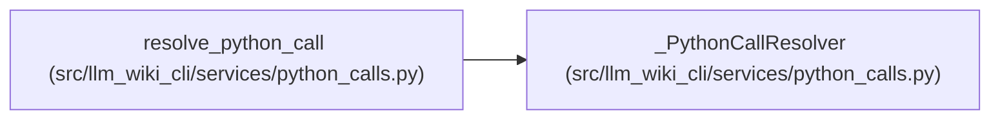

# _PythonCallResolver

**Location:** `src/llm_wiki_cli/services/python_calls.py:66`
**Kind:** Class
**Bases:** —
**Module:** [python_calls](../modules/python_calls.md)

## Description

_Auto-generated from `_PythonCallResolver` in `src/llm_wiki_cli/services/python_calls.py`._

## Attributes

*No annotated attributes found.*

## Methods

| Method | Signature | Decorators | Description |
|--------|-----------|------------|-------------|
| `__init__` | `(resolver: ModulePathResolver, fallback: str)` | — | — |
| `unknown` | `(kind = 'unresolved')` | — | — |
| `binding` | `(binding: Mapping, tail: list[str], filepath: str)` | — | — |
| `member` | `(module: str, members: list[str], origin: str, *, child_import = False)` | — | — |

## Relationships

<!-- Auto-generated relationship summary. Do not edit by hand. -->

### Summary

| Module | Methods | Attributes |
|---|---:|---|
| [python_calls](../modules/python_calls.md) | 4 | — |

### References

| Reference | Kind | Source | Call sites |
|---|---|---|---:|
| `resolve_python_call` | call | [python_calls](../modules/python_calls.md) | 1 |
