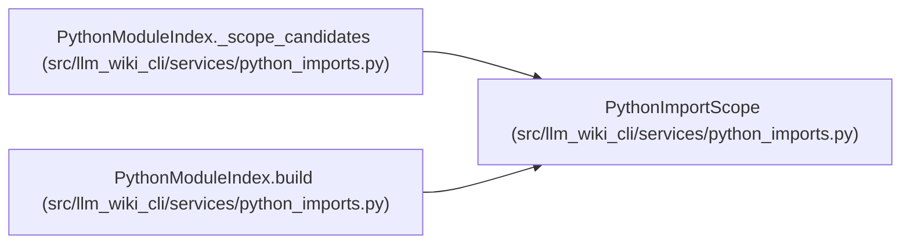

# PythonImportScope

**Location:** `src/llm_wiki_cli/services/python_imports.py:37`
**Kind:** Class
**Bases:** —
**Module:** [python_imports](../modules/python_imports.md)

**Decorators:** `@dataclass(frozen=True)`

## Description

_Auto-generated from `PythonImportScope` in `src/llm_wiki_cli/services/python_imports.py`._

## Attributes

| Name | Type | Default | Description |
|------|------|---------|-------------|
| `root` | `str` | *required* | — |
| `search_roots` | `tuple[str, ...]` | *required* | — |
| `declared` | `bool` | `False` | — |

## Methods

*No public methods. Inherits from base classes.*

## Relationships

<!-- Auto-generated relationship summary. Do not edit by hand. -->

### Summary

| Module | Methods | Attributes |
|---|---:|---|
| [python_imports](../modules/python_imports.md) | 0 | `declared`, `root`, `search_roots` |

### References

| Reference | Kind | Source | Call sites |
|---|---|---|---:|
| `PythonModuleIndex._scope_candidates` | type_reference | [python_imports](../modules/python_imports.md) | — |
| `PythonModuleIndex.build` | call | [python_imports](../modules/python_imports.md) | 3 |
