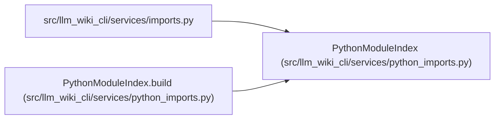

# PythonModuleIndex

**Location:** `src/llm_wiki_cli/services/python_imports.py:44`
**Kind:** Class
**Bases:** —
**Module:** [python_imports](../modules/python_imports.md)

**Decorators:** `@dataclass(frozen=True)`

## Description

_Auto-generated from `PythonModuleIndex` in `src/llm_wiki_cli/services/python_imports.py`._

## Attributes

| Name | Type | Default | Description |
|------|------|---------|-------------|
| `exact` | `dict[str, frozenset[str]]` | *required* | — |
| `scopes` | `tuple[PythonImportScope, ...]` | *required* | — |

## Methods

| Method | Signature | Decorators | Description |
|--------|-----------|------------|-------------|
| `build` | `(inventory: Mapping) -> PythonModuleIndex` | `@classmethod` | — |
| `candidates` | `(module: str, importer: str) -> set[str]` | — | — |
| `_scope_candidates` | `(module: str, scope: PythonImportScope) -> set[str]` | — | — |

## Relationships

<!-- Auto-generated relationship summary. Do not edit by hand. -->

### Summary

| Module | Methods | Attributes |
|---|---:|---|
| [python_imports](../modules/python_imports.md) | 3 | `exact`, `scopes` |

### References

| Reference | Kind | Source | Call sites |
|---|---|---|---:|
| `imports` | import | [imports](../modules/imports.md) | — |
| `PythonModuleIndex.build` | call | [python_imports](../modules/python_imports.md) | 1 |
| `PythonModuleIndex.build` | type_reference | [python_imports](../modules/python_imports.md) | — |
