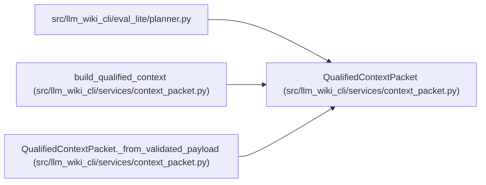

# QualifiedContextPacket

**Location:** `src/llm_wiki_cli/services/context_packet.py:349`
**Kind:** Class
**Bases:** —
**Module:** [context_packet](../modules/context_packet.md)

**Decorators:** `@dataclass(frozen=True)`

## Description

Immutable canonical packet bytes plus safe value accessors.

## Attributes

| Name | Type | Default | Description |
|------|------|---------|-------------|
| `_canonical_bytes` | `bytes` | *required* | — |
| `_payload` | `Mapping[str, Any]` | *required* | — |

## Methods

| Method | Signature | Decorators | Description |
|--------|-----------|------------|-------------|
| `_from_validated_payload` | `(payload: Mapping[str, Any], canonical_bytes: bytes) -> QualifiedContextPacket` | `@classmethod` | — |
| `packet_id` | `() -> str` | `@property` | — |
| `canonical_bytes` | `() -> bytes` | `@property` | — |
| `to_bytes` | `() -> bytes` | — | Return the exact canonical packet bytes. |
| `to_payload` | `() -> dict[str, Any]` | — | Return a mutable JSON-compatible copy of the packet payload. |

## Relationships

<!-- Auto-generated relationship summary. Do not edit by hand. -->

### Summary

| Module | Methods | Attributes |
|---|---:|---|
| [context_packet](../modules/context_packet.md) | 5 | `_canonical_bytes`, `_payload` |

### References

| Reference | Kind | Source | Call sites |
|---|---|---|---:|
| `planner` | import | [planner](../modules/planner.md) | — |
| `build_qualified_context` | type_reference | [context_packet](../modules/context_packet.md) | — |
| `QualifiedContextPacket._from_validated_payload` | type_reference | [context_packet](../modules/context_packet.md) | — |
