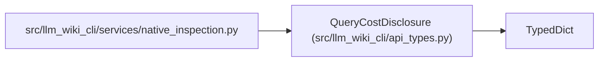

# QueryCostDisclosure

**Location:** `src/llm_wiki_cli/api_types.py:351`
**Kind:** Class
**Bases:** `TypedDict`
**Module:** [api_types](../modules/api_types.md)

## Description

Deterministic disclosure of work selected for a query.

## Attributes

| Name | Type | Presence | Description |
|------|------|----------|-------------|
| `scope` | `Literal['snapshot-index-only', 'targeted-extraction', 'full-inventory']` | *required* | — |
| `full_inventory_performed` | `bool` | *required* | — |
| `supplied_paths` | `int` | *required* | — |

## Methods

*No public methods. Inherits from base classes.*

## Relationships

<!-- Auto-generated relationship summary. Do not edit by hand. -->

### Summary

| Module | Methods | Attributes |
|---|---:|---|
| [api_types](../modules/api_types.md) | 0 | `full_inventory_performed`, `scope`, `supplied_paths` |

### Structure

| Kind | Entity | Module |
|---|---|---|
| Base | `TypedDict` | — |

### References

| Reference | Kind | Source | Call sites |
|---|---|---|---:|
| `native_inspection` | import | [native_inspection](../modules/native_inspection.md) | — |
