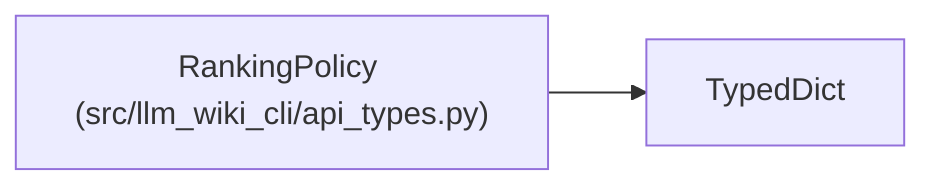

# RankingPolicy

**Location:** `src/llm_wiki_cli/api_types.py:66`
**Kind:** Class
**Bases:** `TypedDict`
**Module:** [api_types](../modules/api_types.md)

## Description

Disclosure for optional current-first budget ranking.

## Attributes

| Name | Type | Default | Description |
|------|------|---------|-------------|
| `requested` | `bool` | *required* | — |
| `policy` | `str` | *required* | — |
| `scope` | `str` | *required* | — |
| `budget_pressure` | `bool` | *required* | — |
| `applied` | `bool` | *required* | — |
| `reason` | `str` | *required* | — |

## Methods

*No public methods. Inherits from base classes.*

## Relationships

<!-- Auto-generated relationship summary. Do not edit by hand. -->

### Summary

| Module | Methods | Attributes |
|---|---:|---|
| [api_types](../modules/api_types.md) | 0 | `applied`, `budget_pressure`, `policy`, `reason`, `requested`, `scope` |

### Structure

| Kind | Entity | Module |
|---|---|---|
| Base | `TypedDict` | — |
