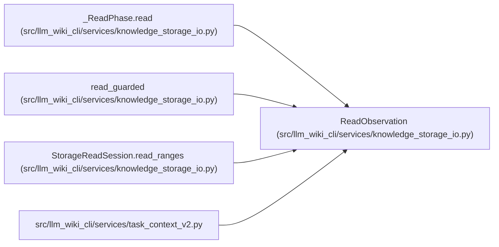

# ReadObservation

**Location:** `src/llm_wiki_cli/services/knowledge_storage_io.py:62`
**Kind:** Class
**Bases:** —
**Module:** [knowledge_storage_io](../modules/knowledge_storage_io.md)

**Decorators:** `@dataclass(frozen=True)`

## Description

Retains exact file content, file identity and ancestor identities for an authoritative reread. Matching content alone cannot hide a relevant replacement or metadata-preserving edit.

## Attributes

| Name | Type | Default | Description |
|------|------|---------|-------------|
| `content` | `bytes` | *required* | — |
| `identity` | `tuple[int, ...]` | *required* | — |
| `directories` | `tuple[tuple[str, tuple[int, ...]], ...]` | *required* | — |

## Methods

*No public methods. Inherits from base classes.*

## Relationships

<!-- Auto-generated relationship summary. Do not edit by hand. -->

### Summary

| Module | Methods | Attributes |
|---|---:|---|
| [knowledge_storage_io](../modules/knowledge_storage_io.md) | 0 | `content`, `directories`, `identity` |

### References

| Reference | Kind | Source | Call sites |
|---|---|---|---:|
| `_ReadPhase.read` | call | [knowledge_storage_io](../modules/knowledge_storage_io.md) | 1 |
| `read_guarded` | call | [knowledge_storage_io](../modules/knowledge_storage_io.md) | 1 |
| `read_guarded` | type_reference | [knowledge_storage_io](../modules/knowledge_storage_io.md) | — |
| `StorageReadSession.read_ranges` | call | [knowledge_storage_io](../modules/knowledge_storage_io.md) | 1 |
| `task_context_v2` | import | [task_context_v2](../modules/task_context_v2.md) | — |
