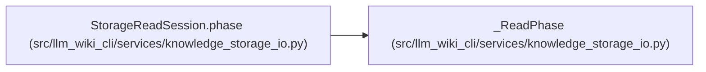

# _ReadPhase

**Location:** `src/llm_wiki_cli/services/knowledge_storage_io.py:68`
**Kind:** Class
**Bases:** —
**Module:** [knowledge_storage_io](../modules/knowledge_storage_io.md)

## Description

Bounded handles owned by one read phase, never by a reusable result.

## Attributes

*No annotated attributes found.*

## Methods

| Method | Signature | Decorators | Description |
|--------|-----------|------------|-------------|
| `__init__` | `(maximum_handles = 128, cancelled = None)` | — | — |
| `close` | `()` | — | — |
| `validate` | `()` | — | Check every pinned namespace binding before a phase can succeed. |
| `check_cancelled` | `()` | — | — |
| `_parents` | `(target)` | — | — |
| `_check_parents` | `(paths)` | — | — |
| `read` | `(path, maximum, *, offset = 0, length = None, file_bytes = None)` | — | — |

## Relationships

<!-- Auto-generated relationship summary. Do not edit by hand. -->

### Summary

| Module | Methods | Attributes |
|---|---:|---|
| [knowledge_storage_io](../modules/knowledge_storage_io.md) | 7 | — |

### References

| Reference | Kind | Source | Call sites |
|---|---|---|---:|
| `StorageReadSession.phase` | call | [knowledge_storage_io](../modules/knowledge_storage_io.md) | 1 |
