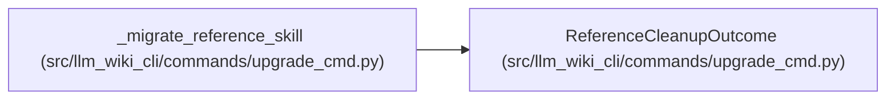

# ReferenceCleanupOutcome

**Location:** `src/llm_wiki_cli/commands/upgrade_cmd.py:117`
**Kind:** Class
**Bases:** —
**Module:** [upgrade_cmd](../modules/upgrade_cmd.md)

**Decorators:** `@dataclass(frozen=True)`

## Description

Whether source-reference cleanup completed and schema must roll back.

## Attributes

| Name | Type | Default | Description |
|------|------|---------|-------------|
| `complete` | `bool` | *required* | — |
| `restore_schema` | `bool` | `False` | — |
| `authority_changed` | `bool` | `False` | — |

## Methods

*No public methods. Inherits from base classes.*

## Relationships

<!-- Auto-generated relationship summary. Do not edit by hand. -->

### Summary

| Module | Methods | Attributes |
|---|---:|---|
| [upgrade_cmd](../modules/upgrade_cmd.md) | 0 | `authority_changed`, `complete`, `restore_schema` |

### References

| Reference | Kind | Source | Call sites |
|---|---|---|---:|
| `_migrate_reference_skill` | call | [upgrade_cmd](../modules/upgrade_cmd.md) | 11 |
| `_migrate_reference_skill` | type_reference | [upgrade_cmd](../modules/upgrade_cmd.md) | — |
