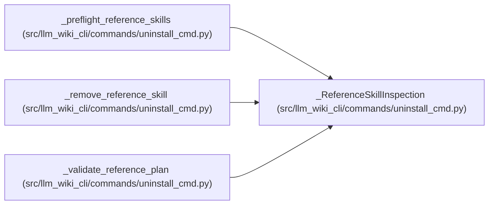

# _ReferenceSkillInspection

**Location:** `src/llm_wiki_cli/commands/uninstall_cmd.py:107`
**Kind:** Class
**Bases:** —
**Module:** [uninstall_cmd](../modules/uninstall_cmd.md)

**Decorators:** `@dataclass(frozen=True)`

## Description

One managed-reference tree classified for the uninstall preview.

## Attributes

| Name | Type | Default | Description |
|------|------|---------|-------------|
| `target` | `Path` | *required* | — |
| `state` | `ReferenceSkillState` | *required* | — |
| `path` | `Path` | *required* | — |
| `reason` | `str` | *required* | — |
| `present` | `bool` | *required* | — |
| `root_identity` | `tuple[int, int] \| None` | `None` | — |
| `tree_manifest` | `GuardedTreeManifest` | `()` | — |

## Methods

*No public methods. Inherits from base classes.*

## Relationships

<!-- Auto-generated relationship summary. Do not edit by hand. -->

### Summary

| Module | Methods | Attributes |
|---|---:|---|
| [uninstall_cmd](../modules/uninstall_cmd.md) | 0 | `path`, `present`, `reason`, `root_identity`, `state`, `target`, `tree_manifest` |

### References

| Reference | Kind | Source |
|---|---|---|
| `_preflight_reference_skills` | call | [uninstall_cmd](../modules/uninstall_cmd.md) |
| `_preflight_reference_skills` | type_reference | [uninstall_cmd](../modules/uninstall_cmd.md) |
| `_remove_reference_skill` | type_reference | [uninstall_cmd](../modules/uninstall_cmd.md) |
| `_validate_reference_plan` | type_reference | [uninstall_cmd](../modules/uninstall_cmd.md) |
