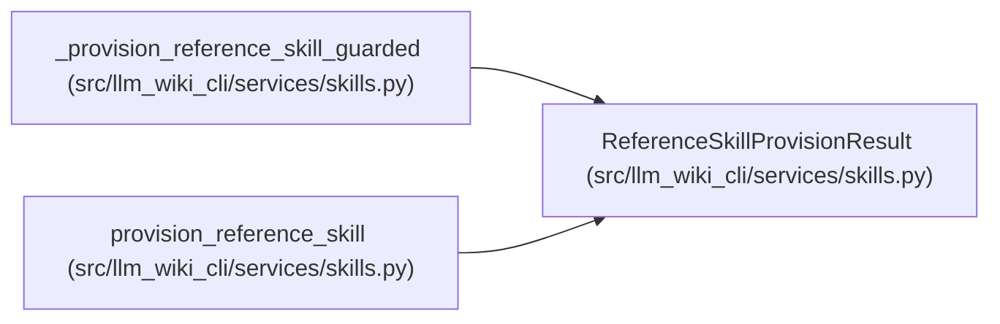

# ReferenceSkillProvisionResult

**Location:** `src/llm_wiki_cli/services/skills.py:224`
**Kind:** Class
**Bases:** —
**Module:** [skills](../modules/skills.md)

**Decorators:** `@dataclass(frozen=True)`

## Description

Safe installation attempt plus its authoritative live verification.

``state``/``reason`` describe the provisioning outcome used for profile
selection. ``verification`` retains the post-attempt live-tree result when
an installation write or exception makes the outcome ``install_error``.

## Attributes

| Name | Type | Default | Description |
|------|------|---------|-------------|
| `state` | `ReferenceSkillState` | *required* | — |
| `reason` | `ReferenceSkillReason` | *required* | — |
| `path` | `Path` | *required* | — |
| `details` | `tuple[str, ...]` | *required* | — |
| `verification` | `ReferenceSkillVerification` | *required* | — |
| `report` | `SkillsReport \| None` | `None` | — |

## Methods

| Method | Signature | Decorators | Description |
|--------|-----------|------------|-------------|
| `ok` | `() -> bool` | `@property` | Return whether installation completed and verified as current. |
| `to_dict` | `() -> dict[str, Any]` | — | Return a JSON-serializable provisioning payload. |

## Relationships

<!-- Auto-generated relationship summary. Do not edit by hand. -->

### Summary

| Module | Methods | Attributes |
|---|---:|---|
| [skills](../modules/skills.md) | 2 | `details`, `path`, `reason`, `report`, `state`, `verification` |

### References

| Reference | Kind | Source | Call sites |
|---|---|---|---:|
| `_provision_reference_skill_guarded` | call | [skills](../modules/skills.md) | 5 |
| `_provision_reference_skill_guarded` | type_reference | [skills](../modules/skills.md) | — |
| `provision_reference_skill` | type_reference | [skills](../modules/skills.md) | — |
