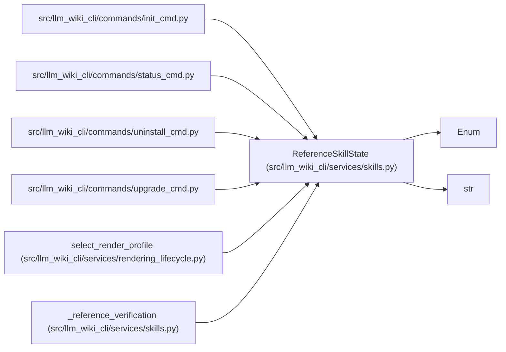

# ReferenceSkillState

**Location:** `src/llm_wiki_cli/services/skills.py:114`
**Kind:** Enum
**Bases:** `str`, `Enum`
**Module:** [skills](../modules/skills.md)

## Description

Stable live/provisioning states for the managed reference skill.

## Attributes

| Name | Declared value | Description |
|------|-------|-------------|
| `ABSENT` | `'absent'` | — |
| `CURRENT` | `'current'` | — |
| `LOCALLY_MODIFIED` | `'locally_modified'` | — |
| `INCOMPLETE` | `'incomplete'` | — |
| `PACKAGE_MISSING` | `'package_missing'` | — |
| `INSTALL_ERROR` | `'install_error'` | — |

## Methods

*No public methods. Inherits from base classes.*

## Relationships

<!-- Auto-generated relationship summary. Do not edit by hand. -->

### Summary

| Module | Methods | Attributes |
|---|---:|---|
| [skills](../modules/skills.md) | 0 | `ABSENT`, `CURRENT`, `INCOMPLETE`, `INSTALL_ERROR`, `LOCALLY_MODIFIED`, `PACKAGE_MISSING` |

### Structure

| Kind | Entity | Module |
|---|---|---|
| Base | `Enum` | — |
| Base | `str` | — |

### References

| Reference | Kind | Source | Call sites |
|---|---|---|---:|
| `init_cmd` | import | [init_cmd](../modules/init_cmd.md) | — |
| `status_cmd` | import | [status_cmd](../modules/status_cmd.md) | — |
| `uninstall_cmd` | import | [uninstall_cmd](../modules/uninstall_cmd.md) | — |
| `upgrade_cmd` | import | [upgrade_cmd](../modules/upgrade_cmd.md) | — |
| `select_render_profile` | type_reference | [rendering_lifecycle](../modules/rendering_lifecycle.md) | — |
| `_reference_verification` | type_reference | [skills](../modules/skills.md) | — |
