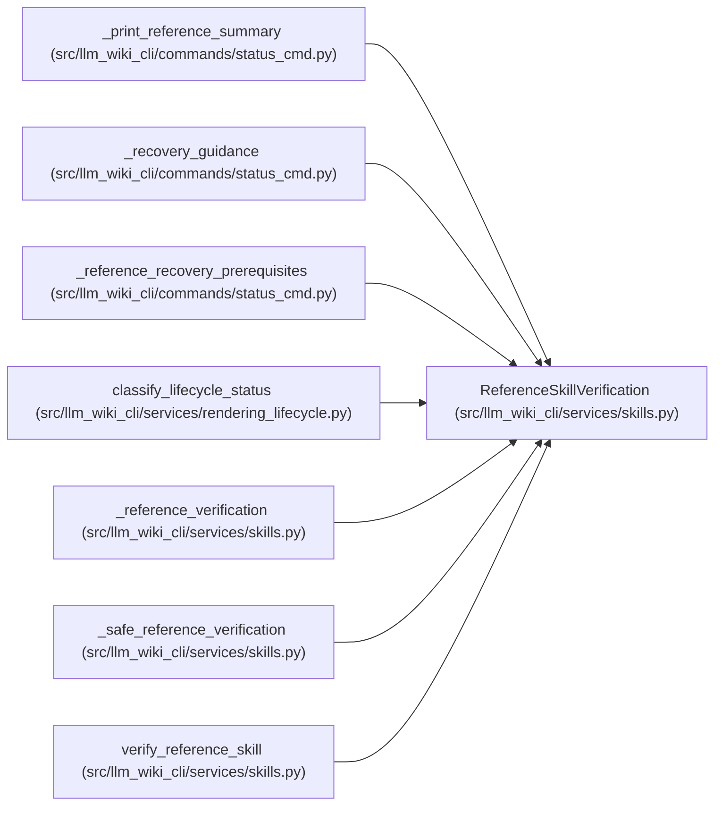

# ReferenceSkillVerification

**Location:** `src/llm_wiki_cli/services/skills.py:170`
**Kind:** Class
**Bases:** —
**Module:** [skills](../modules/skills.md)

**Decorators:** `@dataclass(frozen=True)`

## Description

One read-only classification of the live managed-reference tree.

``path`` is always the requested installed ``wiki-reference`` directory.
``details`` contains sorted, machine-stable diagnostics. Entry diagnostics
use paths relative to the installed or bundled skill root; install report
diagnostics retain the exact path supplied by the report.

## Attributes

| Name | Type | Default | Description |
|------|------|---------|-------------|
| `state` | `ReferenceSkillState` | *required* | — |
| `reason` | `ReferenceSkillReason` | *required* | — |
| `path` | `Path` | *required* | — |
| `details` | `tuple[str, ...]` | `()` | — |

## Methods

| Method | Signature | Decorators | Description |
|--------|-----------|------------|-------------|
| `current` | `() -> bool` | `@property` | Return whether the exact normalized bundled tree is installed. |
| `to_dict` | `() -> dict[str, Any]` | — | Return a JSON-serializable lifecycle payload. |

## Relationships

<!-- Auto-generated relationship summary. Do not edit by hand. -->

### Summary

| Module | Methods | Attributes |
|---|---:|---|
| [skills](../modules/skills.md) | 2 | `details`, `path`, `reason`, `state` |

### References

| Reference | Kind | Source |
|---|---|---|
| `_print_reference_summary` | type_reference | [status_cmd](../modules/status_cmd.md) |
| `_recovery_guidance` | type_reference | [status_cmd](../modules/status_cmd.md) |
| `_reference_recovery_prerequisites` | type_reference | [status_cmd](../modules/status_cmd.md) |
| `classify_lifecycle_status` | type_reference | [rendering_lifecycle](../modules/rendering_lifecycle.md) |
| `_reference_verification` | call | [skills](../modules/skills.md) |
| `_reference_verification` | type_reference | [skills](../modules/skills.md) |
| `_safe_reference_verification` | type_reference | [skills](../modules/skills.md) |
| `verify_reference_skill` | type_reference | [skills](../modules/skills.md) |
