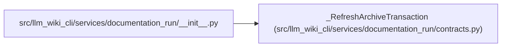

# _RefreshArchiveTransaction

**Location:** `src/llm_wiki_cli/services/documentation_run/contracts.py:925`
**Kind:** Class
**Bases:** —
**Module:** [documentation_run_contracts](../modules/documentation_run_contracts.md)

**Decorators:** `@dataclass`

## Description

Tracks an archived run until its replacement is safely committed.

## Attributes

| Name | Type | Default | Description |
|------|------|---------|-------------|
| `workspace_root` | `Path \| None` | `None` | — |
| `archive` | `Path \| None` | `None` | — |
| `prior_run_id` | `str \| None` | `None` | — |
| `phase` | `str \| None` | `None` | — |

## Methods

| Method | Signature | Decorators | Description |
|--------|-----------|------------|-------------|
| `active` | `() -> bool` | `@property` | — |

## Relationships

<!-- Auto-generated relationship summary. Do not edit by hand. -->

### Summary

| Module | Methods | Attributes |
|---|---:|---|
| [documentation_run_contracts](../modules/documentation_run_contracts.md) | 1 | `archive`, `phase`, `prior_run_id`, `workspace_root` |

### References

| Reference | Kind | Source | Call sites |
|---|---|---|---:|
| `__init__` | import | [documentation_run___init__](../modules/documentation_run___init__.md) | — |
