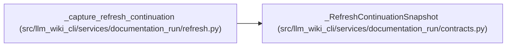

# _RefreshContinuationSnapshot

**Location:** `src/llm_wiki_cli/services/documentation_run/contracts.py:914`
**Kind:** Class
**Bases:** —
**Module:** [documentation_run_contracts](../modules/documentation_run_contracts.md)

**Decorators:** `@dataclass(frozen=True)`

## Description

Safe in-memory handoff from an archived run to a refreshed baseline.

## Attributes

| Name | Type | Default | Description |
|------|------|---------|-------------|
| `prior_run_id` | `str` | *required* | — |
| `prior_source_revision` | `str` | *required* | — |
| `prior_source_fingerprint` | `str \| None` | *required* | — |
| `prior_wiki_tree_hash` | `str` | *required* | — |
| `pages` | `dict[str, dict[str, Any]]` | *required* | — |

## Methods

*No public methods. Inherits from base classes.*

## Relationships

<!-- Auto-generated relationship summary. Do not edit by hand. -->

### Summary

| Module | Methods | Attributes |
|---|---:|---|
| [documentation_run_contracts](../modules/documentation_run_contracts.md) | 0 | `pages`, `prior_run_id`, `prior_source_fingerprint`, `prior_source_revision`, `prior_wiki_tree_hash` |

### References

| Reference | Kind | Source | Call sites |
|---|---|---|---:|
| `_capture_refresh_continuation` | call | [refresh](../modules/refresh.md) | 1 |
