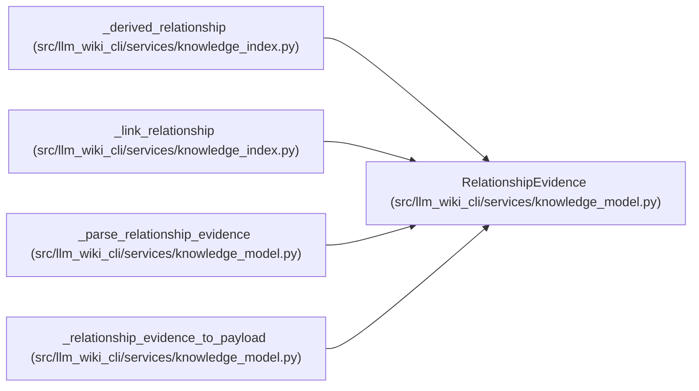

# RelationshipEvidence

**Location:** `src/llm_wiki_cli/services/knowledge_model.py:429`
**Kind:** Class
**Bases:** —
**Module:** [knowledge_model](../modules/knowledge_model.md)

**Decorators:** `@dataclass(frozen=True)`

## Description

_Auto-generated from `RelationshipEvidence` in `src/llm_wiki_cli/services/knowledge_model.py`._

## Attributes

| Name | Type | Default | Description |
|------|------|---------|-------------|
| `state` | `EvidenceState` | `EvidenceState.UNKNOWN` | — |
| `source_content_hash` | `Optional[str]` | `None` | — |
| `concept_observation_hash` | `Optional[str]` | `None` | — |
| `page_hash` | `Optional[str]` | `None` | — |
| `aggregate_input_hash` | `Optional[str]` | `None` | — |
| `extensions` | `Extensions` | `field(default_factory=dict)` | — |

## Methods

*No public methods. Inherits from base classes.*

## Relationships

<!-- Auto-generated relationship summary. Do not edit by hand. -->

### Summary

| Module | Methods | Attributes |
|---|---:|---|
| [knowledge_model](../modules/knowledge_model.md) | 0 | `aggregate_input_hash`, `concept_observation_hash`, `extensions`, `page_hash`, `source_content_hash`, `state` |

### References

| Reference | Kind | Source |
|---|---|---|
| `_derived_relationship` | call | [knowledge_index](../modules/knowledge_index.md) |
| `_link_relationship` | call | [knowledge_index](../modules/knowledge_index.md) |
| `_parse_relationship_evidence` | call | [knowledge_model](../modules/knowledge_model.md) |
| `_parse_relationship_evidence` | type_reference | [knowledge_model](../modules/knowledge_model.md) |
| `_relationship_evidence_to_payload` | type_reference | [knowledge_model](../modules/knowledge_model.md) |
