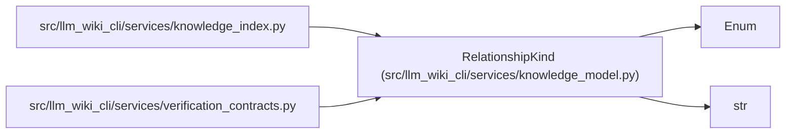

# RelationshipKind

**Location:** `src/llm_wiki_cli/services/knowledge_model.py:228`
**Kind:** Enum
**Bases:** `str`, `Enum`
**Module:** [knowledge_model](../modules/knowledge_model.md)

## Description

_Auto-generated from `RelationshipKind` in `src/llm_wiki_cli/services/knowledge_model.py`._

## Attributes

| Name | Declared value | Description |
|------|-------|-------------|
| `DERIVED_FROM` | `'derived_from'` | — |
| `LINKS_TO` | `'links_to'` | — |

## Methods

*No public methods. Inherits from base classes.*

## Relationships

<!-- Auto-generated relationship summary. Do not edit by hand. -->

### Summary

| Module | Methods | Attributes |
|---|---:|---|
| [knowledge_model](../modules/knowledge_model.md) | 0 | `DERIVED_FROM`, `LINKS_TO` |

### Structure

| Kind | Entity | Module |
|---|---|---|
| Base | `Enum` | — |
| Base | `str` | — |

### References

| Reference | Kind | Source |
|---|---|---|
| `knowledge_index` | import | [knowledge_index](../modules/knowledge_index.md) |
| `verification_contracts` | import | [verification_contracts](../modules/verification_contracts.md) |
