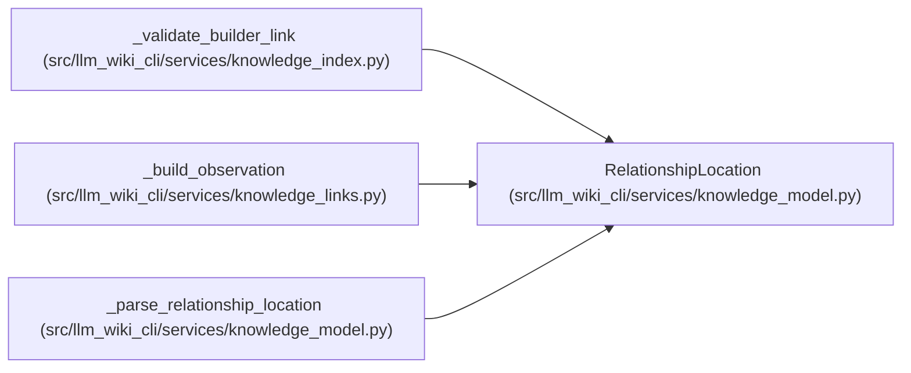

# RelationshipLocation

**Location:** `src/llm_wiki_cli/services/knowledge_model.py:382`
**Kind:** Class
**Bases:** —
**Module:** [knowledge_model](../modules/knowledge_model.md)

**Decorators:** `@dataclass(frozen=True)`

## Description

Half-open character offsets for a relationship observation.

## Attributes

| Name | Type | Default | Description |
|------|------|---------|-------------|
| `start` | `int` | *required* | — |
| `end` | `int` | *required* | — |
| `extensions` | `Extensions` | `field(default_factory=dict)` | — |

## Methods

*No public methods. Inherits from base classes.*

## Relationships

<!-- Auto-generated relationship summary. Do not edit by hand. -->

### Summary

| Module | Methods | Attributes |
|---|---:|---|
| [knowledge_model](../modules/knowledge_model.md) | 0 | `end`, `extensions`, `start` |

### References

| Reference | Kind | Source | Call sites |
|---|---|---|---:|
| `_validate_builder_link` | call | [knowledge_index](../modules/knowledge_index.md) | 1 |
| `_build_observation` | call | [knowledge_links](../modules/knowledge_links.md) | 1 |
| `_parse_relationship_location` | call | [knowledge_model](../modules/knowledge_model.md) | 1 |
| `_parse_relationship_location` | type_reference | [knowledge_model](../modules/knowledge_model.md) | — |
