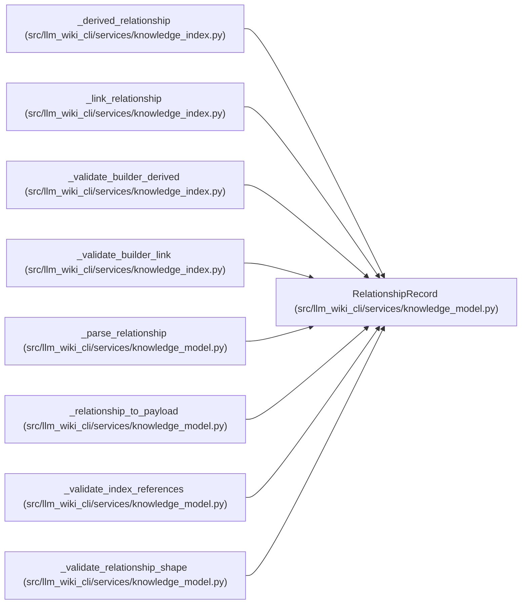

# RelationshipRecord

**Location:** `src/llm_wiki_cli/services/knowledge_model.py:439`
**Kind:** Class
**Bases:** —
**Module:** [knowledge_model](../modules/knowledge_model.md)

**Decorators:** `@dataclass(frozen=True)`

## Description

_Auto-generated from `RelationshipRecord` in `src/llm_wiki_cli/services/knowledge_model.py`._

## Attributes

| Name | Type | Default | Description |
|------|------|---------|-------------|
| `kind` | `RelationshipKindValue` | *required* | — |
| `source_locator` | `str` | *required* | — |
| `target` | `RelationshipTarget` | *required* | — |
| `origin` | `Origin` | *required* | — |
| `evidence` | `RelationshipEvidence` | *required* | — |
| `resolution` | `Resolution` | *required* | — |
| `extensions` | `Extensions` | `field(default_factory=dict)` | — |

## Methods

*No public methods. Inherits from base classes.*

## Relationships

<!-- Auto-generated relationship summary. Do not edit by hand. -->

### Summary

| Module | Methods | Attributes |
|---|---:|---|
| [knowledge_model](../modules/knowledge_model.md) | 0 | `evidence`, `extensions`, `kind`, `origin`, `resolution`, `source_locator`, `target` |

### References

| Reference | Kind | Source | Call sites |
|---|---|---|---:|
| `_derived_relationship` | call | [knowledge_index](../modules/knowledge_index.md) | 1 |
| `_derived_relationship` | type_reference | [knowledge_index](../modules/knowledge_index.md) | — |
| `_link_relationship` | call | [knowledge_index](../modules/knowledge_index.md) | 1 |
| `_link_relationship` | type_reference | [knowledge_index](../modules/knowledge_index.md) | — |
| `_validate_builder_derived` | type_reference | [knowledge_index](../modules/knowledge_index.md) | — |
| `_validate_builder_link` | type_reference | [knowledge_index](../modules/knowledge_index.md) | — |
| `_parse_relationship` | call | [knowledge_model](../modules/knowledge_model.md) | 1 |
| `_parse_relationship` | type_reference | [knowledge_model](../modules/knowledge_model.md) | — |
| `_relationship_to_payload` | type_reference | [knowledge_model](../modules/knowledge_model.md) | — |
| `_validate_index_references` | type_reference | [knowledge_model](../modules/knowledge_model.md) | — |
| `_validate_relationship_shape` | type_reference | [knowledge_model](../modules/knowledge_model.md) | — |
