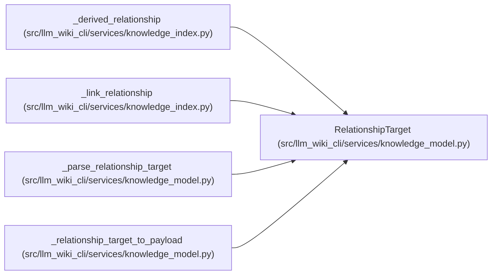

# RelationshipTarget

**Location:** `src/llm_wiki_cli/services/knowledge_model.py:391`
**Kind:** Class
**Bases:** —
**Module:** [knowledge_model](../modules/knowledge_model.md)

**Decorators:** `@dataclass(frozen=True)`

## Description

_Auto-generated from `RelationshipTarget` in `src/llm_wiki_cli/services/knowledge_model.py`._

## Attributes

| Name | Type | Default | Description |
|------|------|---------|-------------|
| `target_class` | `TargetClass` | `TargetClass.UNKNOWN` | — |
| `locator` | `Optional[str]` | `None` | — |
| `canonical_path` | `Optional[str]` | `None` | — |
| `source_path` | `Optional[str]` | `None` | — |
| `external_uri` | `Optional[str]` | `None` | — |
| `raw_target` | `Optional[str]` | `None` | — |
| `normalized_target` | `Optional[str]` | `None` | — |
| `label` | `Optional[str]` | `None` | — |
| `location` | `Optional[RelationshipLocation]` | `None` | — |
| `extensions` | `Extensions` | `field(default_factory=dict)` | — |

## Methods

| Method | Signature | Decorators | Description |
|--------|-----------|------------|-------------|
| `endpoint_kind` | `() -> str` | `@property` | — |
| `kind` | `() -> str` | `@property` | Compatibility view of the endpoint or unresolved raw observation. |
| `value` | `() -> Optional[str]` | `@property` | — |

## Relationships

<!-- Auto-generated relationship summary. Do not edit by hand. -->

### Summary

| Module | Methods | Attributes |
|---|---:|---|
| [knowledge_model](../modules/knowledge_model.md) | 3 | `canonical_path`, `extensions`, `external_uri`, `label`, `location`, `locator`, `normalized_target`, `raw_target`, `source_path`, `target_class` |

### References

| Reference | Kind | Source | Call sites |
|---|---|---|---:|
| `_derived_relationship` | call | [knowledge_index](../modules/knowledge_index.md) | 1 |
| `_link_relationship` | call | [knowledge_index](../modules/knowledge_index.md) | 1 |
| `_parse_relationship_target` | call | [knowledge_model](../modules/knowledge_model.md) | 1 |
| `_parse_relationship_target` | type_reference | [knowledge_model](../modules/knowledge_model.md) | — |
| `_relationship_target_to_payload` | type_reference | [knowledge_model](../modules/knowledge_model.md) | — |
