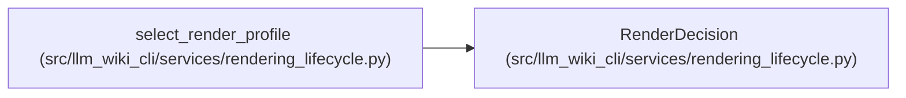

# RenderDecision

**Location:** `src/llm_wiki_cli/services/rendering_lifecycle.py:49`
**Kind:** Class
**Bases:** —
**Module:** [rendering_lifecycle](../modules/rendering_lifecycle.md)

**Decorators:** `@dataclass(frozen=True)`

## Description

One deterministic profile choice from intent and verified state.

## Attributes

| Name | Type | Default | Description |
|------|------|---------|-------------|
| `profile` | `SchemaRenderProfile` | *required* | — |
| `reason` | `RenderReason` | *required* | — |

## Methods

| Method | Signature | Decorators | Description |
|--------|-----------|------------|-------------|
| `version` | `() -> int` | `@property` | Return the managed marker version persisted with this decision. |

## Relationships

<!-- Auto-generated relationship summary. Do not edit by hand. -->

### Summary

| Module | Methods | Attributes |
|---|---:|---|
| [rendering_lifecycle](../modules/rendering_lifecycle.md) | 1 | `profile`, `reason` |

### References

| Reference | Kind | Source | Call sites |
|---|---|---|---:|
| `select_render_profile` | call | [rendering_lifecycle](../modules/rendering_lifecycle.md) | 3 |
| `select_render_profile` | type_reference | [rendering_lifecycle](../modules/rendering_lifecycle.md) | — |
