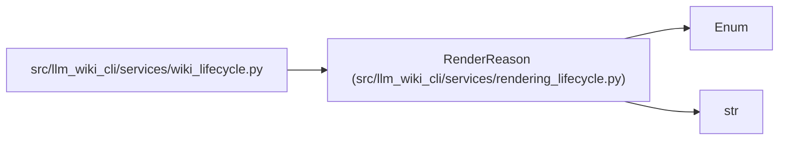

# RenderReason

**Location:** `src/llm_wiki_cli/services/rendering_lifecycle.py:22`
**Kind:** Enum
**Bases:** `str`, `Enum`
**Module:** [rendering_lifecycle](../modules/rendering_lifecycle.md)

## Description

Stable reasons persisted alongside the last rendered profile.

## Attributes

| Name | Declared value | Description |
|------|-------|-------------|
| `REFERENCE_CURRENT` | `'reference-current'` | — |
| `SKILLS_DISABLED` | `'skills-disabled'` | — |
| `REFERENCE_ABSENT` | `'reference-absent'` | — |
| `REFERENCE_MODIFIED` | `'reference-modified'` | — |
| `REFERENCE_INCOMPLETE` | `'reference-incomplete'` | — |
| `PACKAGE_MISSING` | `'package-missing'` | — |
| `INSTALL_ERROR` | `'install-error'` | — |

## Methods

*No public methods. Inherits from base classes.*

## Relationships

<!-- Auto-generated relationship summary. Do not edit by hand. -->

### Summary

| Module | Methods | Attributes |
|---|---:|---|
| [rendering_lifecycle](../modules/rendering_lifecycle.md) | 0 | `INSTALL_ERROR`, `PACKAGE_MISSING`, `REFERENCE_ABSENT`, `REFERENCE_CURRENT`, `REFERENCE_INCOMPLETE`, `REFERENCE_MODIFIED`, `SKILLS_DISABLED` |

### Structure

| Kind | Entity | Module |
|---|---|---|
| Base | `Enum` | — |
| Base | `str` | — |

### References

| Reference | Kind | Source | Call sites |
|---|---|---|---:|
| `wiki_lifecycle` | import | [wiki_lifecycle](../modules/wiki_lifecycle.md) | — |
