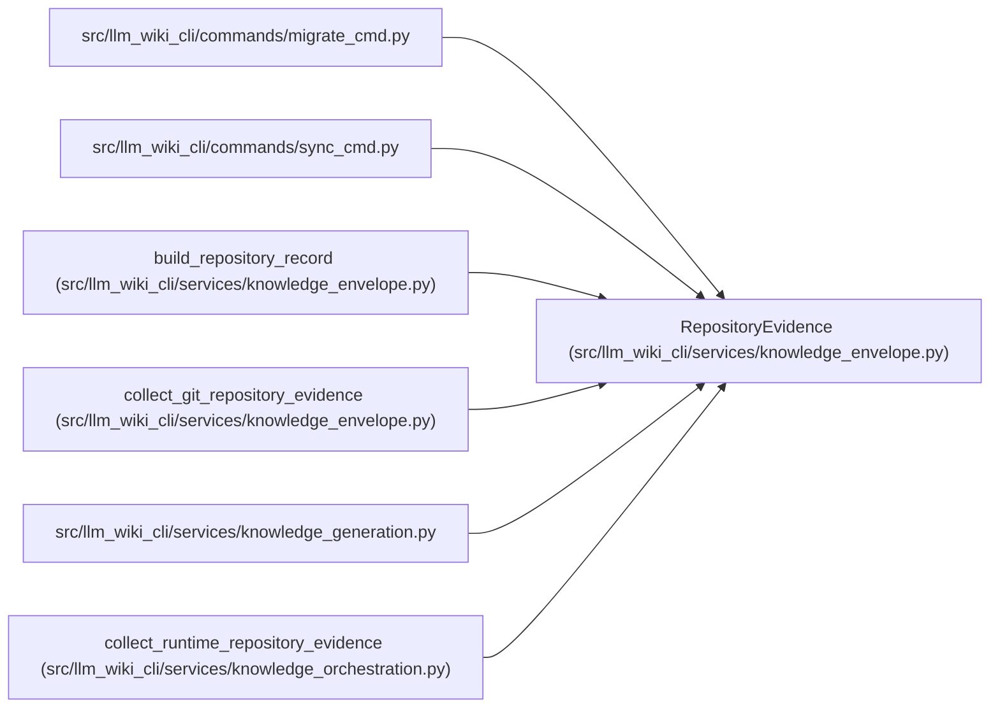

# RepositoryEvidence

**Location:** `src/llm_wiki_cli/services/knowledge_envelope.py:233`
**Kind:** Class
**Bases:** —
**Module:** [knowledge_envelope](../modules/knowledge_envelope.md)

**Decorators:** `@dataclass(frozen=True)`

## Description

Already collected local VCS evidence; raw remotes are never serialized.

## Attributes

| Name | Type | Default | Description |
|------|------|---------|-------------|
| `remotes` | `Mapping[str, str \| None]` | `field(default_factory=dict)` | — |
| `remotes_evaluated` | `bool` | `True` | — |
| `upstream_remote` | `str \| None` | `None` | — |
| `upstream_remote_evaluated` | `bool` | `True` | — |
| `evaluated_revision` | `str \| None` | `None` | — |
| `working_tree` | `WorkingTreeState` | `WorkingTreeState.UNKNOWN` | — |

## Methods

*No public methods. Inherits from base classes.*

## Relationships

<!-- Auto-generated relationship summary. Do not edit by hand. -->

### Summary

| Module | Methods | Attributes |
|---|---:|---|
| [knowledge_envelope](../modules/knowledge_envelope.md) | 0 | `evaluated_revision`, `remotes`, `remotes_evaluated`, `upstream_remote`, `upstream_remote_evaluated`, `working_tree` |

### References

| Reference | Kind | Source |
|---|---|---|
| `migrate_cmd` | import | [migrate_cmd](../modules/migrate_cmd.md) |
| `sync_cmd` | import | [sync_cmd](../modules/sync_cmd.md) |
| `build_repository_record` | call | [knowledge_envelope](../modules/knowledge_envelope.md) |
| `build_repository_record` | type_reference | [knowledge_envelope](../modules/knowledge_envelope.md) |
| `collect_git_repository_evidence` | call | [knowledge_envelope](../modules/knowledge_envelope.md) |
| `collect_git_repository_evidence` | call | [knowledge_envelope](../modules/knowledge_envelope.md) |
| `collect_git_repository_evidence` | type_reference | [knowledge_envelope](../modules/knowledge_envelope.md) |
| `knowledge_generation` | import | [knowledge_generation](../modules/knowledge_generation.md) |
| `collect_runtime_repository_evidence` | type_reference | [knowledge_orchestration](../modules/knowledge_orchestration.md) |
