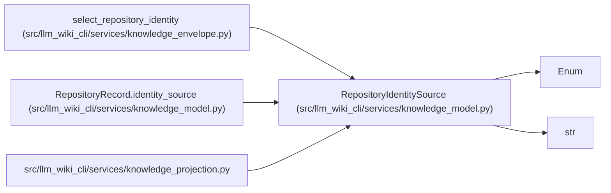

# RepositoryIdentitySource

**Location:** `src/llm_wiki_cli/services/knowledge_model.py:212`
**Kind:** Enum
**Bases:** `str`, `Enum`
**Module:** [knowledge_model](../modules/knowledge_model.md)

## Description

How a repository identity was selected by an application-owned writer.

## Attributes

| Name | Declared value | Description |
|------|-------|-------------|
| `CONFIGURED_PUBLIC` | `'configured-public'` | — |
| `NORMALIZED_VCS` | `'normalized-vcs'` | — |
| `UNKNOWN` | `'unknown'` | — |

## Methods

*No public methods. Inherits from base classes.*

## Relationships

<!-- Auto-generated relationship summary. Do not edit by hand. -->

### Summary

| Module | Methods | Attributes |
|---|---:|---|
| [knowledge_model](../modules/knowledge_model.md) | 0 | `CONFIGURED_PUBLIC`, `NORMALIZED_VCS`, `UNKNOWN` |

### Structure

| Kind | Entity | Module |
|---|---|---|
| Base | `Enum` | — |
| Base | `str` | — |

### References

| Reference | Kind | Source | Call sites |
|---|---|---|---:|
| `select_repository_identity` | type_reference | [knowledge_envelope](../modules/knowledge_envelope.md) | — |
| `RepositoryRecord.identity_source` | call | [knowledge_model](../modules/knowledge_model.md) | 1 |
| `RepositoryRecord.identity_source` | type_reference | [knowledge_model](../modules/knowledge_model.md) | — |
| `knowledge_projection` | import | [knowledge_projection](../modules/knowledge_projection.md) | — |
