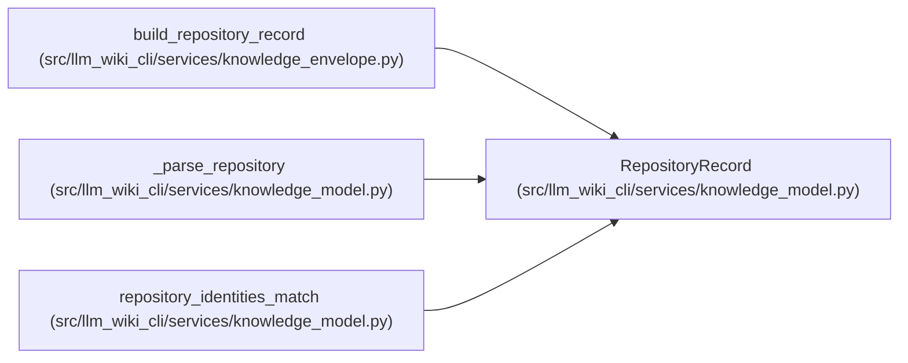

# RepositoryRecord

**Location:** `src/llm_wiki_cli/services/knowledge_model.py:275`
**Kind:** Class
**Bases:** —
**Module:** [knowledge_model](../modules/knowledge_model.md)

**Decorators:** `@dataclass(frozen=True)`

## Description

_Auto-generated from `RepositoryRecord` in `src/llm_wiki_cli/services/knowledge_model.py`._

## Attributes

| Name | Type | Default | Description |
|------|------|---------|-------------|
| `identity` | `str` | *required* | — |
| `evaluated_revision` | `str` | `'unknown'` | — |
| `working_tree` | `WorkingTreeState` | `WorkingTreeState.UNKNOWN` | — |
| `extensions` | `Extensions` | `field(default_factory=dict)` | — |

## Methods

| Method | Signature | Decorators | Description |
|--------|-----------|------------|-------------|
| `identity_source` | `() -> RepositoryIdentitySource` | `@property` | Return the redaction-relevant source of the selected identity. |

## Relationships

<!-- Auto-generated relationship summary. Do not edit by hand. -->

### Summary

| Module | Methods | Attributes |
|---|---:|---|
| [knowledge_model](../modules/knowledge_model.md) | 1 | `evaluated_revision`, `extensions`, `identity`, `working_tree` |

### References

| Reference | Kind | Source | Call sites |
|---|---|---|---:|
| `build_repository_record` | call | [knowledge_envelope](../modules/knowledge_envelope.md) | 1 |
| `build_repository_record` | type_reference | [knowledge_envelope](../modules/knowledge_envelope.md) | — |
| `_parse_repository` | call | [knowledge_model](../modules/knowledge_model.md) | 1 |
| `_parse_repository` | type_reference | [knowledge_model](../modules/knowledge_model.md) | — |
| `repository_identities_match` | type_reference | [knowledge_model](../modules/knowledge_model.md) | — |
