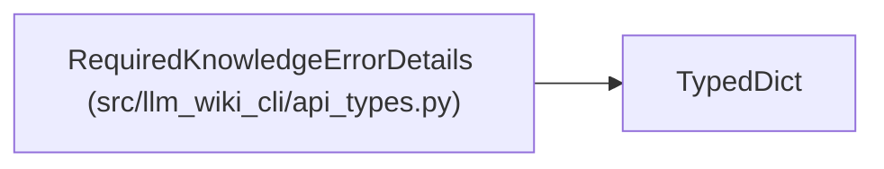

# RequiredKnowledgeErrorDetails

**Location:** `src/llm_wiki_cli/api_types.py:77`
**Kind:** Class
**Bases:** `TypedDict`
**Module:** [api_types](../modules/api_types.md)

## Description

Stable details attached to required-mode interface failures.

## Attributes

| Name | Type | Default | Description |
|------|------|---------|-------------|
| `code` | `str` | *required* | — |
| `field` | `str` | *required* | — |
| `mode` | `str` | *required* | — |
| `availability` | `str` | *required* | — |
| `reason` | `str` | *required* | — |
| `fallback_evidence` | `list[str]` | *required* | — |
| `recovery_command` | `str` | *required* | — |
| `mutation_permitted` | `bool` | *required* | — |

## Methods

*No public methods. Inherits from base classes.*

## Relationships

<!-- Auto-generated relationship summary. Do not edit by hand. -->

### Summary

| Module | Methods | Attributes |
|---|---:|---|
| [api_types](../modules/api_types.md) | 0 | `availability`, `code`, `fallback_evidence`, `field`, `mode`, `mutation_permitted`, `reason`, `recovery_command` |

### Structure

| Kind | Entity | Module |
|---|---|---|
| Base | `TypedDict` | — |
