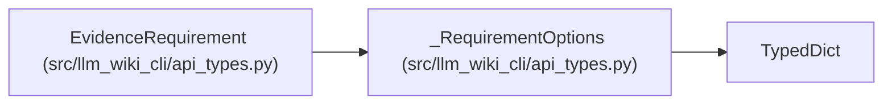

# _RequirementOptions

**Location:** `src/llm_wiki_cli/api_types.py:22`
**Kind:** Class
**Bases:** `TypedDict`
**Module:** [api_types](../modules/api_types.md)

## Description

Optional observation criterion for a requirement. Present evidence and complete runtime behavior are distinct; incomplete static graphs cannot establish an unqualified negative.

## Attributes

| Name | Type | Presence | Description |
|------|------|----------|-------------|
| `criterion` | `Literal['present', 'complete']` | *optional* | — |

## Methods

*No public methods. Inherits from base classes.*

## Relationships

<!-- Auto-generated relationship summary. Do not edit by hand. -->

### Summary

| Module | Methods | Attributes |
|---|---:|---|
| [api_types](../modules/api_types.md) | 0 | `criterion` |

### Structure

| Kind | Entity | Module |
|---|---|---|
| Base | `TypedDict` | — |
| Subclass | `EvidenceRequirement` | [api_types](../modules/api_types.md) |